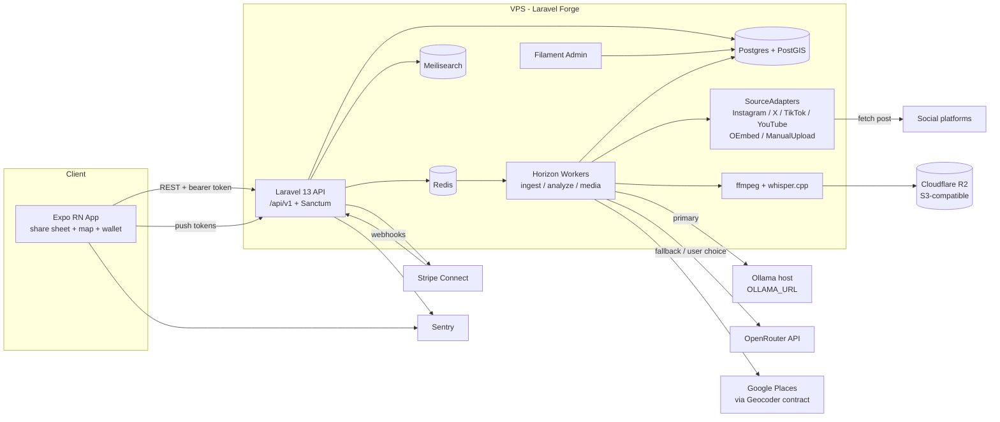
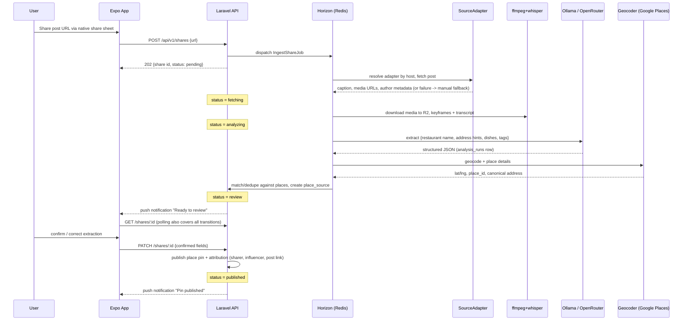

# Reelmap — 01: Architecture

Status: canonical spec for build agents. Version policy: latest stable at implementation time (Laravel 13, PHP 8.4+, latest Expo SDK, latest Filament). The M0 scaffold task resolves and pins exact versions.

## 1. Tech Stack

| Concern | Choice | Package / Service | Rationale |
|---|---|---|---|
| Backend framework | Laravel 13 (PHP 8.4+) | `laravel/framework` | Batteries-included REST API, first-party queue/auth/admin ecosystem, fastest path for a small team; huge agent-friendly documentation surface. |
| API auth | Laravel Sanctum | `laravel/sanctum` | Bearer tokens for a first-party mobile app. Passport (full OAuth2 server) is overkill: we are not issuing tokens to third-party clients. Sanctum personal access tokens per device, revocable, zero OAuth server maintenance. |
| Queues / workers | Horizon on Redis | `laravel/horizon`, `predis` or phpredis | Ingestion + analysis are long-running async jobs; Horizon gives dashboards, per-queue balancing, retries, metrics out of the box. Redis also serves cache + rate limiting. |
| Database | Postgres 16+ with PostGIS | `postgis` extension, `clickbar/laravel-magellan` (or raw expressions) | Map product: PostGIS gives real geospatial types/indexes (`geography(Point)`, GiST, `ST_DWithin`, bbox queries, clustering). MySQL spatial support is weaker (no geography type, poorer function coverage) and Meilisearch does not replace DB-side geo filtering. Also: JSONB for raw AI extraction payloads. |
| Search | Meilisearch via Scout | `laravel/scout`, `meilisearch/meilisearch-php` | Typo-tolerant instant search for places/tags/influencers; trivial self-hosting on the same VPS; Scout keeps indexes synced from Eloquent models. |
| Admin | Filament | `filament/filament` | Full admin panel (moderation, place claims, ledger inspection, analysis-run debugging) in-process with the API, no separate frontend to build. |
| Mobile | Expo React Native (TypeScript) | `expo`, EAS Build/Submit | vs bare RN: we need a native iOS share extension + Android intent filters — `expo-share-intent` provides both via config plugin without ejecting; EAS handles signing/builds. vs Flutter: TS type sharing with `packages/contracts`, stronger share-sheet/maps library ecosystem, one language across repo. |
| Share ingestion (mobile) | expo-share-intent | `expo-share-intent` | Config-plugin generation of the iOS share extension and Android intent filters; delivers shared URL/text into JS on warm and cold start. |
| Maps (mobile) | react-native-maps | `react-native-maps` | Mature, Expo-compatible (dev client / EAS), native Apple Maps on iOS + Google Maps on Android, supports custom markers and region-driven data loading for clustered pins. |
| Geocoding / places | Google Places API behind a `Geocoder` contract | `app/Contracts/Geocoder.php` + `GooglePlacesGeocoder` | Best-in-class restaurant coverage and place details. Wrapped in an interface so provider can be swapped (Mapbox, Nominatim) or faked in tests; responses cached to control cost. |
| AI — local first | Ollama | Self-hosted host, `OLLAMA_URL` env | Zero marginal cost per analysis, data privacy, no vendor lock-in. Runs vision+text models (e.g. llama/qwen-VL class) for caption + frame analysis. |
| AI — remote fallback | OpenRouter | HTTPS API, user-selectable model | Single API for many frontier models when local model fails, is overloaded, or user opts into higher quality. Both drivers sit behind one `AnalysisModel` contract. |
| Media processing | ffmpeg + whisper.cpp | `ffmpeg` binary, `whisper.cpp` (or Whisper via Ollama-adjacent runner) | ffmpeg extracts audio + keyframes from shared videos/screen recordings; whisper.cpp transcribes speech locally (cheap, private) to feed the extraction prompt. |
| Payments / payouts | Stripe Connect Express | `stripe/stripe-php`, Laravel Cashier optional | Influencer revenue share requires KYC'd payouts; Express onboarding offloads compliance. Restaurant offer billing on standard Stripe. Double-entry `ledger_entries` table is ours; Stripe only moves money. |
| Object storage | Cloudflare R2 (S3-compatible) | `league/flysystem-aws-s3-v3` | Videos/thumbnails are egress-heavy; R2 has zero egress fees and speaks S3, so the storage driver stays `s3` and provider is swappable. |
| Observability | Sentry + basic analytics | `sentry/sentry-laravel`, `@sentry/react-native`; PostHog or Plausible for product analytics | Crash/error tracking on both API and app from day one; lightweight privacy-friendly product analytics for funnel metrics (share→publish conversion). |
| CI | GitHub Actions | — | pint, phpstan, pest, eslint, tsc, expo prebuild check (see §7). |

## 2. System Components

- **Mobile app (Expo RN)** — share-sheet entry, map/feed UI, share status screens, review/confirm extraction, offers wallet, QR redemption.
- **Laravel 13 API** — REST `/api/v1`, Sanctum auth, owns all domain logic and the double-entry ledger.
- **Redis + Horizon workers** — queues: `ingest`, `analyze`, `media`, `notifications`, `payouts`.
- **Ingestion adapters** — `App\Adapters\SourceAdapter` interface; implementations: `InstagramAdapter`, `XAdapter`, `TikTokAdapter`, `YouTubeAdapter`, `GenericOEmbedAdapter`, `ManualUploadAdapter`. Resolver picks adapter by URL host; every chain terminates in `ManualUploadAdapter`.
- **Analysis pipeline workers** — chained jobs: fetch → media processing (ffmpeg keyframes, whisper.cpp transcript) → LLM extraction (Ollama, fallback OpenRouter) → geocode (Geocoder contract → Google Places) → place matching/dedup → review or publish.
- **Ollama host** — same VPS or separate GPU box; configurable via `OLLAMA_URL`.
- **OpenRouter** — remote model fallback, user-selectable model id stored on user preference.
- **Google Places** — geocoding + place details behind `Geocoder` contract, cached in `place_sources`/cache.
- **S3-compatible storage (Cloudflare R2)** — media_assets originals, keyframes, thumbnails; presigned upload URLs for manual fallback.
- **Meilisearch** — `places`, `tags`, `users/influencers` indexes via Scout.
- **Filament admin** — moderation queue, reports, place claims, analysis-run inspector, ledger/payout ops.
- **Stripe** — Connect Express accounts, transfers/payouts, webhooks.



## 3. Share → Ingest → Analyze → Publish Flow

Share lifecycle status: `pending → fetching → analyzing → review → published`, terminal failure state `failed` (retryable). Status changes are persisted on `shares.status` and pushed to the app via **polling** (`GET /api/v1/shares/:id`) **plus push notification** on the `review`, `published`, and `failed` transitions.



Numbered steps:

1. User taps Share on Instagram/X/TikTok/YouTube, picks Reelmap; app receives URL/text via share intent.
2. App calls `POST /api/v1/shares` with the URL (plus optional manual caption/screen-recording upload); API creates `shares` row (`pending`), dispatches `IngestShareJob`, returns `202`.
3. Adapter resolver selects the platform `SourceAdapter`; status → `fetching`. Public posts fetched directly (oEmbed/scrape); private posts via the user's linked `platform_accounts` token; guaranteed fallback: user pastes caption / uploads screen recording (`ManualUploadAdapter`).
4. Fetched media stored as `media_assets` on R2; ffmpeg extracts keyframes + audio; whisper.cpp produces transcript. Status → `analyzing`.
5. `AnalyzePostJob` sends caption + transcript + keyframes to Ollama (primary) or OpenRouter (fallback / user-selected model); result stored as an `analysis_runs` row with structured place candidates.
6. Geocoder contract resolves the candidate to lat/lng + Google `place_id`; dedupe against existing `places` (place_id match, then name+distance heuristic). New or matched place linked via `place_sources`.
7. Status → `review`; push notification sent. User confirms or corrects extraction in-app (`PATCH /shares/:id`).
8. On confirm, place pin is published with attribution (sharer, influencer, original post link); status → `published`, notification sent. Any hard failure sets `failed` with a machine-readable reason and a retry affordance (`POST /shares/:id/retry`).

## 4. Share-Sheet Ingestion Mechanics (expo-share-intent)

**iOS** — `expo-share-intent` config plugin generates a native **Share Extension** target (separate bundle id suffix `.ShareExtension`, shared App Group). The extension does not run JS; it serializes the shared payload (URL and/or text, occasionally video file for screen recordings) into the App Group container and opens the host app via custom scheme. Requires EAS build (not Expo Go). Apple share payloads from social apps are almost always a canonical post URL; sometimes URL embedded in text — the app extracts the first URL with a regex and keeps the remainder as `shared_text`.

**Android** — plugin injects `<intent-filter>` for `ACTION_SEND` with `text/plain` (and `video/*` for manual screen-recording shares) into the main activity manifest. Payload arrives as `Intent.EXTRA_TEXT` (URL or caption text) or a content URI for media.

**What arrives:** platform post URL (normal case), free text containing a URL, plain text caption only, or a video file. The app maps this to `POST /shares` fields: `url`, `shared_text`, and optional presigned media upload.

**Cold start:** `useShareIntent()` distinguishes warm start (event listener fires) from cold start (intent retrieved at launch from the App Group / initial intent). Flow: root layout checks `hasShareIntent` before first render → routes to `/share/new` with the payload → payload is cleared (`resetShareIntent()`) so re-foregrounding does not re-submit. If the user is unauthenticated, the payload is held in memory/secure storage, auth flow runs, then submission resumes.

## 5. Per-Platform Ingestion Strategy

Every chain terminates in **manual fallback** (paste URL + paste caption and/or upload screen recording via `ManualUploadAdapter`) — ingestion can never dead-end.

| Platform | Primary | Secondary | Pragmatic option | ToS risk | Fallback chain |
|---|---|---|---|---|---|
| Instagram | oEmbed (public posts/reels; requires Meta app review for oEmbed Read) | Graph API with linked user token (`platform_accounts`) for own/authorized content | yt-dlp-style fetcher for public reels (media + caption) | **High** (scraping violates Meta ToS; oEmbed access can be revoked) | oEmbed → Graph API (user token) → yt-dlp-style fetcher → manual upload |
| X (Twitter) | oEmbed / publish.x.com (public posts, caption text) | X API v2 with user token (paid tiers; use only if economical) | Syndication/embed JSON endpoints; yt-dlp-style for video | **Medium-High** (API pricing hostile; unofficial endpoints unstable) | oEmbed → user-token API → unofficial fetcher → manual upload |
| TikTok | oEmbed (public videos: title/author/thumbnail, no video file) | Display API with linked user token (own videos) | yt-dlp-style fetcher for public video + caption | **Medium** (fetcher against ToS but widely tolerated; oEmbed is official) | oEmbed → Display API (user token) → yt-dlp-style fetcher → manual upload |
| YouTube | oEmbed + Data API v3 (official, generous quota: title, description, channel) | Captions via Data API where permitted | yt-dlp for video/audio when transcript needed and captions unavailable | **Low** (official APIs cover nearly everything) | Data API/oEmbed → yt-dlp for media → manual upload |
| Anything else | `GenericOEmbedAdapter` (oEmbed discovery + OpenGraph meta) | — | — | Low | oEmbed/OG → manual upload |

Operational rules: fetchers run server-side in queue jobs with per-platform rate limits and circuit breakers; adapter failures are recorded on `analysis_runs`/`shares.failure_reason`; a platform can be force-downgraded to manual-only via config flag without deploy.

## 6. Monorepo Structure

```text
reelmap/
├── apps/
│   ├── api/                          # Laravel 13
│   │   ├── app/
│   │   │   ├── Adapters/             # SourceAdapter.php (interface) + per-platform adapters
│   │   │   │   ├── SourceAdapter.php
│   │   │   │   ├── InstagramAdapter.php
│   │   │   │   ├── XAdapter.php
│   │   │   │   ├── TikTokAdapter.php
│   │   │   │   ├── YouTubeAdapter.php
│   │   │   │   ├── GenericOEmbedAdapter.php
│   │   │   │   └── ManualUploadAdapter.php
│   │   │   ├── Contracts/            # Geocoder.php, AnalysisModel.php
│   │   │   ├── Services/             # AdapterResolver, AnalysisService, GooglePlacesGeocoder,
│   │   │   │                         # OllamaClient, OpenRouterClient, PlaceMatcher,
│   │   │   │                         # LedgerService, RedemptionService, MediaProcessor
│   │   │   ├── Jobs/                 # IngestShareJob, ProcessMediaJob, AnalyzePostJob,
│   │   │   │                         # GeocodePlaceJob, PublishShareJob, PayoutJob
│   │   │   ├── Http/
│   │   │   │   ├── Controllers/Api/V1/
│   │   │   │   ├── Requests/
│   │   │   │   └── Resources/        # JSON resources matching packages/contracts schemas
│   │   │   ├── Models/               # User, PlatformAccount, Influencer, SourcePost, Share,
│   │   │   │                         # MediaAsset, AnalysisRun, Place, PlaceSource, Tag, Follow,
│   │   │   │                         # Offer, Redemption, LedgerEntry, Payout, PlaceClaim, Report
│   │   │   ├── Filament/             # admin resources & pages
│   │   │   ├── Events/  Listeners/  Notifications/  Policies/
│   │   ├── config/  database/migrations/  routes/api.php  tests/
│   │   └── composer.json
│   ├── mobile/                       # Expo React Native (TypeScript)
│   │   ├── app/                      # expo-router
│   │   │   ├── _layout.tsx           # auth gate + share-intent cold-start handling
│   │   │   ├── (auth)/login.tsx  register.tsx
│   │   │   ├── (tabs)/
│   │   │   │   ├── index.tsx         # map
│   │   │   │   ├── feed.tsx
│   │   │   │   ├── search.tsx
│   │   │   │   ├── wallet.tsx
│   │   │   │   └── profile.tsx
│   │   │   ├── share/new.tsx  [id].tsx        # ingest status + review/confirm
│   │   │   ├── place/[id].tsx
│   │   │   ├── user/[handle].tsx  influencer/[id].tsx
│   │   │   └── offer/[id].tsx  redeem.tsx     # QR scan/show
│   │   ├── src/
│   │   │   ├── api/                  # typed client generated from packages/contracts
│   │   │   ├── components/  hooks/  stores/  lib/
│   │   ├── app.config.ts             # expo-share-intent + maps config plugins
│   │   ├── eas.json
│   │   └── package.json
│   └── ...
├── packages/
│   └── contracts/
│       ├── schemas/                  # JSON Schemas: share.json, place.json, analysis-run.json,
│       │                             # offer.json, redemption.json, ledger-entry.json, errors.json
│       ├── src/generated/            # TS types generated from schemas (json-schema-to-typescript)
│       ├── scripts/generate.ts
│       └── package.json
├── .github/workflows/ci.yml
├── package.json                      # workspaces: apps/mobile, packages/contracts
└── README.md
```

Convention: standard Laravel structure plus `app/Services`, `app/Jobs`, `app/Adapters` (no DDD `app/Domain` layer). `packages/contracts` JSON Schemas are the single source of truth; API resources are contract-tested against them (Pest) and TS types are generated for the app.

## 7. Environments & Deployment

- **Local:** Laravel Sail (Docker: postgres+postgis, redis, meilisearch, mailpit) or Laravel Herd + local services — developer's choice; Sail compose file is the reference environment. Ollama runs natively on the dev machine; `OLLAMA_URL=http://host.docker.internal:11434` under Sail. Mobile: Expo dev client (EAS development build — required for share intent and maps), API reachable over LAN/tunnel.
- **Staging & production:** single VPS provisioned by **Laravel Forge** (nginx, PHP 8.4, Postgres+PostGIS, Redis, Meilisearch on the same box; separate site + DB per environment initially). Zero-downtime-ish deploys via Forge deploy script (`composer install`, `migrate --force`, `horizon:terminate`).
- **Queue workers:** Horizon as a Forge daemon (`php artisan horizon`), restarted on deploy via `horizon:terminate`; queues `ingest`, `analyze`, `media`, `notifications`, `payouts` with per-queue concurrency in `config/horizon.php`.
- **Ollama:** same VPS if CPU-viable for the chosen model, otherwise separate GPU host; always addressed via `OLLAMA_URL`, timeout + automatic OpenRouter fallback configured in `config/analysis.php`.
- **Storage:** Cloudflare R2 buckets `reelmap-staging`, `reelmap-prod` via the S3 driver; presigned URLs for direct mobile uploads.
- **Mobile:** EAS Build for iOS/Android (dev, preview/staging with staging API URL, production profiles in `eas.json`); EAS Submit to App Store / Play; OTA updates via EAS Update for JS-only changes.
- **CI (GitHub Actions), on every PR:**
  - api: `pint --test`, `phpstan analyse`, `pest` (Postgres+PostGIS + Redis services in the workflow).
  - mobile: `eslint`, `tsc --noEmit`, `expo prebuild --no-install` check (config-plugin sanity).
  - contracts: schema validation + regenerate TS types and fail on uncommitted diff.
- **Observability:** Sentry DSNs per environment (API + app releases tagged with git SHA / EAS build); basic product analytics (PostHog or Plausible) initialized at M0, events added per phase.

## 8. Phase Mapping (context for build agents)

M0 Foundations: monorepo scaffold, CI, auth, contracts pipeline, deploy targets. M1 Ingest & Analyze: §3–§5 pipeline. M2 Map & Discovery: PostGIS map queries, Meilisearch. M3 Social: follows, public maps/profiles, feed. M4 Monetization: offers, redemptions, ledger, Stripe Connect. M5 Hardening & Launch: rate limits, moderation tooling, load/ToS-risk review, store submission.
