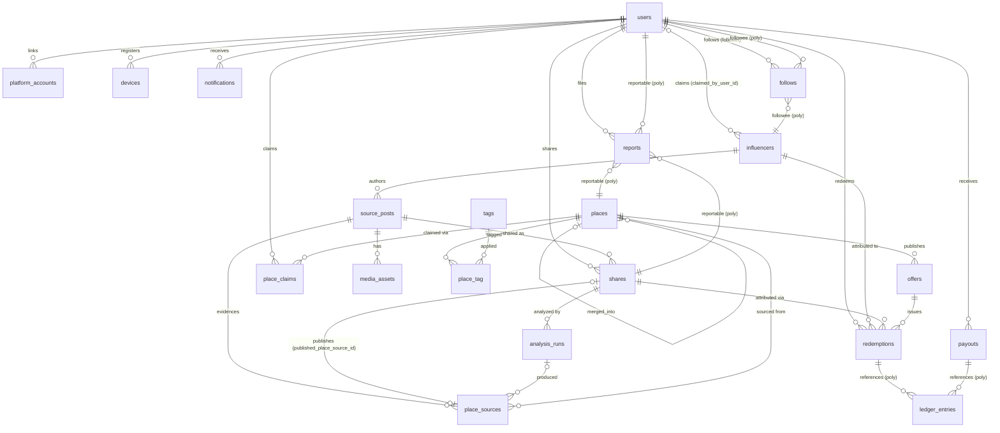
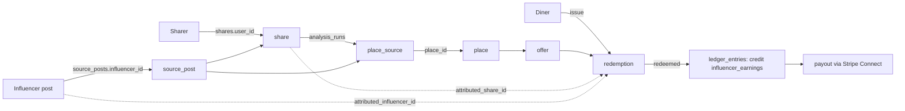

# Reelmap — 02 Data Model

Canonical database specification. Postgres 16+ with PostGIS. Laravel 13 migrations, Eloquent models, PHP-backed enums in `app/Enums`. All tables use `bigint` identity primary keys named `id`, plus `created_at`/`updated_at` (`timestamptz`) unless noted. Soft deletes (`deleted_at timestamptz null`) only where flagged. Monetary values are stored as `bigint` minor units (cents) — never floats.

---

## 1. Entity-Relationship Diagram

Polymorphic edges (`follows.followee`, `reports.reportable`, `ledger_entries.reference`, `notifications.notifiable`) are shown illustratively; they are `*_type` + `*_id` column pairs, not DB-level FKs.

---

## 2. PHP-Backed Enums

All enums live in `app/Enums`, backed by `string` unless noted. DB columns storing enums are `varchar` with a `CHECK` constraint generated in the migration (not native Postgres enum types — easier to evolve).

| Enum | Values |
|---|---|
| `Platform` | `instagram`, `x`, `tiktok`, `youtube` |
| `PostPrivacy` | `public`, `private`, `unknown` |
| `FetchStatus` | `pending`, `fetching`, `fetched`, `manual`, `failed` |
| `ShareStatus` | `pending`, `fetching`, `analyzing`, `review`, `published`, `failed`, `rejected` |
| `MediaKind` | `video`, `audio`, `keyframe`, `thumbnail`, `screen_recording` |
| `AnalysisEngine` | `local`, `openrouter` |
| `AnalysisStatus` | `queued`, `running`, `succeeded`, `failed` |
| `PlaceStatus` | `pending`, `active`, `merged`, `hidden` |
| `TagKind` | `cuisine`, `vibe`, `dish`, `diet`, `other` |
| `ClaimMethod` | `phone_otp`, `email_domain`, `document`, `google_business` |
| `ClaimStatus` | `pending`, `verified`, `rejected` |
| `OfferDiscountType` | `percent`, `fixed_amount`, `free_item` |
| `OfferStatus` | `draft`, `active`, `paused`, `expired`, `archived` |
| `RedemptionStatus` | `issued`, `redeemed`, `expired`, `void` |
| `LedgerAccount` | `platform_revenue`, `influencer_earnings`, `restaurant_fees`, `restaurant_receivable`, `stripe_fees`, `payout_clearing` |
| `LedgerDirection` | `debit`, `credit` |
| `PayoutStatus` | `pending`, `processing`, `paid`, `failed`, `reversed` |
| `ReportReason` | `spam`, `wrong_place`, `inappropriate`, `copyright`, `fraud`, `other` |
| `ReportStatus` | `open`, `reviewing`, `resolved`, `dismissed` |

---

## 3. Table Specifications

### 3.1 `users`
Account records for all human actors. Roles are **boolean flags** (decision: a user can be several roles at once — e.g. a diner who owns a restaurant; a single role enum cannot express that). Every user is implicitly a diner.

| Column | Type | Null | Default | Notes |
|---|---|---|---|---|
| id | bigint identity | no | — | PK |
| name | varchar(120) | no | — | display name |
| username | citext | no | — | public handle, `/@username` |
| email | citext | no | — | |
| email_verified_at | timestamptz | yes | null | |
| password | varchar(255) | yes | null | null for social-only signups |
| avatar_path | varchar(2048) | yes | null | S3/local disk path |
| bio | text | yes | null | |
| is_influencer | boolean | no | false | set when an `influencers` row is claimed |
| is_restaurant_owner | boolean | no | false | set on first verified `place_claims` |
| is_admin | boolean | no | false | Filament access |
| preferred_analysis_model | varchar(120) | yes | null | user-selectable model override |
| stripe_connect_account_id | varchar(255) | yes | null | Connect Express (influencers) |
| stripe_connect_onboarded_at | timestamptz | yes | null | |
| is_public | boolean | no | true | public profile/map visibility |
| remember_token | varchar(100) | yes | null | |
| deleted_at | timestamptz | yes | null | soft delete |

Indexes: unique(`username`), unique(`email`), unique(`stripe_connect_account_id`) where not null, index(`is_admin`).

### 3.2 `platform_accounts`
OAuth-linked social platform accounts, used to fetch private posts the user can see and to auto-claim influencer identities.

| Column | Type | Null | Default | Notes |
|---|---|---|---|---|
| id | bigint identity | no | — | PK |
| user_id | bigint | no | — | FK → users.id, cascade delete |
| platform | varchar(16) | no | — | `Platform` enum |
| external_user_id | varchar(255) | no | — | platform's user id |
| handle | citext | no | — | platform username at link time |
| access_token | text | yes | null | encrypted (Laravel `encrypted` cast) |
| refresh_token | text | yes | null | encrypted |
| token_expires_at | timestamptz | yes | null | |
| scopes | jsonb | no | `'[]'` | granted OAuth scopes |
| last_synced_at | timestamptz | yes | null | |

Indexes: unique(`platform`, `external_user_id`), unique(`user_id`, `platform`), index(`handle`).
FKs: `user_id` → users (ON DELETE CASCADE).

### 3.3 `influencers`
Canonical influencer identity — exists independently of whether the person has a Reelmap account. Created lazily when a post by an unseen author is ingested.

| Column | Type | Null | Default | Notes |
|---|---|---|---|---|
| id | bigint identity | no | — | PK |
| platform | varchar(16) | no | — | `Platform` enum |
| handle | citext | no | — | normalized, no leading `@` |
| display_name | varchar(255) | yes | null | |
| avatar_url | varchar(2048) | yes | null | remote URL, mirrored async |
| claimed_by_user_id | bigint | yes | null | FK → users.id; set when a `platform_accounts` row matches platform+external id/handle |
| claimed_at | timestamptz | yes | null | |
| follower_count_cached | integer | yes | null | refreshed by scheduled job |
| follower_count_synced_at | timestamptz | yes | null | |

Indexes: unique(`platform`, `handle`), index(`claimed_by_user_id`).
FKs: `claimed_by_user_id` → users (ON DELETE SET NULL).

### 3.4 `source_posts`
One row per original social post, deduplicated across sharers.

| Column | Type | Null | Default | Notes |
|---|---|---|---|---|
| id | bigint identity | no | — | PK |
| platform | varchar(16) | no | — | `Platform` enum |
| external_id | varchar(255) | no | — | platform post id / shortcode |
| url | varchar(2048) | no | — | canonicalized |
| influencer_id | bigint | yes | null | FK → influencers.id; null until author resolved |
| caption | text | yes | null | |
| posted_at | timestamptz | yes | null | |
| privacy | varchar(16) | no | `'unknown'` | `PostPrivacy` |
| oembed_json | jsonb | yes | null | raw oEmbed / API payload |
| fetch_status | varchar(16) | no | `'pending'` | `FetchStatus`; `manual` = user pasted caption / screen recording |
| fetched_at | timestamptz | yes | null | |

Indexes: unique(`platform`, `external_id`), index(`influencer_id`), index(`fetch_status`), GIN(`oembed_json`) optional (defer).
FKs: `influencer_id` → influencers (ON DELETE SET NULL).

### 3.5 `shares`
A user's act of sharing a post into Reelmap. Pipeline state machine lives here. Many users can share the same `source_post`.

| Column | Type | Null | Default | Notes |
|---|---|---|---|---|
| id | bigint identity | no | — | PK |
| user_id | bigint | no | — | FK → users.id (the sharer) |
| source_post_id | bigint | no | — | FK → source_posts.id |
| status | varchar(16) | no | `'pending'` | `ShareStatus` |
| failure_reason | text | yes | null | human-readable; set on `failed`/`rejected` |
| published_place_source_id | bigint | yes | null | FK → place_sources.id; set on `published` |
| shared_via | varchar(32) | yes | null | `share_sheet`, `paste_url`, `manual` |
| published_at | timestamptz | yes | null | |

Indexes: unique(`user_id`, `source_post_id`) — one share per user per post; index(`status`), index(`source_post_id`), index(`published_place_source_id`).
FKs: `user_id` → users (CASCADE); `source_post_id` → source_posts (CASCADE); `published_place_source_id` → place_sources (SET NULL). The place_sources FK is added in a **later migration** than the table (circular dep, see §5).

Status transitions: `pending → fetching → analyzing → (review|published|failed)`; `review → (published|rejected)`; any → `failed` with `failure_reason`.

### 3.6 `media_assets`
Downloaded/derived media for a source post (video file, extracted audio, keyframes, thumbnails, user screen recordings for manual fallback).

| Column | Type | Null | Default | Notes |
|---|---|---|---|---|
| id | bigint identity | no | — | PK |
| source_post_id | bigint | no | — | FK → source_posts.id, cascade |
| kind | varchar(24) | no | — | `MediaKind` |
| storage_path | varchar(2048) | no | — | disk-relative path |
| disk | varchar(32) | no | `'s3'` | Laravel filesystem disk |
| mime | varchar(127) | no | — | |
| bytes | bigint | yes | null | |
| duration_ms | integer | yes | null | video/audio only |
| width | integer | yes | null | |
| height | integer | yes | null | |
| sha256 | char(64) | no | — | dedup + integrity |
| frame_at_ms | integer | yes | null | keyframes only: offset into video |

Indexes: index(`source_post_id`, `kind`), unique(`sha256`, `source_post_id`), index(`sha256`).
FKs: `source_post_id` → source_posts (ON DELETE CASCADE).

### 3.7 `analysis_runs`
One AI extraction attempt per row. A share may have several runs (local failed → openrouter retry; user re-runs with a different model).

| Column | Type | Null | Default | Notes |
|---|---|---|---|---|
| id | bigint identity | no | — | PK |
| share_id | bigint | no | — | FK → shares.id, cascade |
| engine | varchar(16) | no | — | `AnalysisEngine` |
| model | varchar(120) | no | — | e.g. `qwen2.5-vl:7b`, `anthropic/claude-sonnet` |
| status | varchar(16) | no | `'queued'` | `AnalysisStatus` |
| started_at | timestamptz | yes | null | |
| finished_at | timestamptz | yes | null | |
| input_tokens | integer | yes | null | |
| output_tokens | integer | yes | null | |
| cost_usd | numeric(10,6) | yes | null | 0 for `local` |
| overall_confidence | numeric(4,3) | yes | null | 0.000–1.000 |
| result_json | jsonb | yes | null | MUST validate against `packages/contracts` extraction schema before persist |
| error | text | yes | null | |

Indexes: index(`share_id`, `status`), index(`engine`, `model`), index(`finished_at`).
FKs: `share_id` → shares (ON DELETE CASCADE).

### 3.8 `places`
Deduplicated restaurant entities — the map pins.

| Column | Type | Null | Default | Notes |
|---|---|---|---|---|
| id | bigint identity | no | — | PK |
| name | varchar(255) | no | — | |
| slug | varchar(280) | no | — | globally unique, name + short hash |
| location | geography(Point,4326) | no | — | PostGIS |
| address_line1 | varchar(255) | yes | null | |
| address_line2 | varchar(255) | yes | null | |
| city | varchar(120) | yes | null | |
| region | varchar(120) | yes | null | state/province |
| postal_code | varchar(24) | yes | null | |
| country_code | char(2) | no | — | ISO 3166-1 alpha-2 |
| google_place_id | varchar(255) | yes | null | primary dedup key |
| cuisine_primary | varchar(64) | yes | null | denormalized headline cuisine |
| price_range | smallint | yes | null | 1–4, CHECK (price_range BETWEEN 1 AND 4) |
| phone | varchar(32) | yes | null | E.164 |
| website | varchar(2048) | yes | null | |
| opening_hours_json | jsonb | yes | null | Google-style periods |
| status | varchar(16) | no | `'pending'` | `PlaceStatus` |
| merged_into_place_id | bigint | yes | null | FK → places.id (self); set when `status = merged` |
| shares_count | integer | no | 0 | counter cache (published place_sources) |
| avg_extraction_confidence | numeric(4,3) | yes | null | rolling avg over place_sources' runs |
| normalized_name | varchar(255) | no | — | lower, unaccented, stripped legal suffixes; maintained in model observer |

Indexes: **GIST(`location`)**; unique(`slug`); unique(`google_place_id`) where not null (partial unique index); index(`status`); index(`country_code`, `city`); index(`merged_into_place_id`); trigram GIN(`normalized_name`) (`pg_trgm`) for similarity matching.
FKs: `merged_into_place_id` → places (ON DELETE SET NULL).
Requires extensions: `postgis`, `pg_trgm`, `unaccent`, `citext` (enable in the very first migration).

### 3.9 `place_sources`
Join/evidence table: N posts (via N shares) map to one deduped place. This is the provenance backbone and the attribution anchor.

| Column | Type | Null | Default | Notes |
|---|---|---|---|---|
| id | bigint identity | no | — | PK |
| place_id | bigint | no | — | FK → places.id |
| source_post_id | bigint | no | — | FK → source_posts.id |
| share_id | bigint | no | — | FK → shares.id |
| analysis_run_id | bigint | yes | null | FK → analysis_runs.id; null for pure-manual entries |
| extraction_snapshot_json | jsonb | no | — | the extracted-place payload as of publish (immutable) |
| is_primary | boolean | no | false | exactly one primary per place (partial unique) |

Indexes: unique(`place_id`, `share_id`); unique(`share_id`) — a share publishes at most one place source; index(`source_post_id`); partial unique(`place_id`) where `is_primary = true`.
FKs: `place_id` → places (CASCADE); `source_post_id` → source_posts (CASCADE); `share_id` → shares (CASCADE); `analysis_run_id` → analysis_runs (SET NULL).

### 3.10 `tags` and `place_tag`
Decision: **simple `place_tag` pivot, no polymorphic taggable** — only places are tagged in M2–M5; YAGNI on morph. Revisit only if profile tagging ships.

`tags`:

| Column | Type | Null | Default | Notes |
|---|---|---|---|---|
| id | bigint identity | no | — | PK |
| kind | varchar(16) | no | — | `TagKind` |
| name | varchar(80) | no | — | display |
| slug | varchar(96) | no | — | |

Indexes: unique(`kind`, `slug`).

`place_tag` (no `id`, no timestamps — pure pivot):

| Column | Type | Null | Default | Notes |
|---|---|---|---|---|
| place_id | bigint | no | — | FK → places.id, cascade |
| tag_id | bigint | no | — | FK → tags.id, cascade |
| source | varchar(16) | no | `'extraction'` | `extraction`, `manual`, `owner` |
| confidence | numeric(4,3) | yes | null | from analysis when source=extraction |

Indexes: PK(`place_id`, `tag_id`); index(`tag_id`).

### 3.11 `follows`
Polymorphic followee: a user can follow another user (their map) or an influencer (their trail of places).

| Column | Type | Null | Default | Notes |
|---|---|---|---|---|
| id | bigint identity | no | — | PK |
| follower_user_id | bigint | no | — | FK → users.id, cascade |
| followee_type | varchar(32) | no | — | morph class: `user` \| `influencer` (enum-mapped) |
| followee_id | bigint | no | — | no DB FK (polymorphic) |

Indexes: unique(`follower_user_id`, `followee_type`, `followee_id`); index(`followee_type`, `followee_id`).
App-level guard: cannot follow self.

### 3.12 `place_claims`
Restaurant-owner verification.

| Column | Type | Null | Default | Notes |
|---|---|---|---|---|
| id | bigint identity | no | — | PK |
| place_id | bigint | no | — | FK → places.id, cascade |
| user_id | bigint | no | — | FK → users.id, cascade |
| method | varchar(24) | no | — | `ClaimMethod` |
| status | varchar(16) | no | `'pending'` | `ClaimStatus` |
| evidence_json | jsonb | yes | null | doc path, OTP metadata, etc. |
| verified_at | timestamptz | yes | null | |
| reviewed_by_user_id | bigint | yes | null | FK → users.id (admin), SET NULL |

Indexes: partial unique(`place_id`) where `status = 'verified'` — one verified owner per place; index(`user_id`), index(`status`).

### 3.13 `offers`
Restaurant promotions redeemable via QR/code.

| Column | Type | Null | Default | Notes |
|---|---|---|---|---|
| id | bigint identity | no | — | PK |
| place_id | bigint | no | — | FK → places.id, cascade |
| created_by_user_id | bigint | no | — | FK → users.id (verified owner) |
| title | varchar(160) | no | — | |
| description | text | yes | null | |
| discount_type | varchar(16) | no | — | `OfferDiscountType` |
| discount_value | integer | no | — | percent (1–100) or minor units or item count |
| terms | text | yes | null | |
| starts_at | timestamptz | no | — | |
| ends_at | timestamptz | yes | null | null = open-ended |
| quota_total | integer | yes | null | null = unlimited |
| quota_per_user | integer | no | 1 | |
| redemptions_count | integer | no | 0 | counter cache |
| influencer_share_bps | smallint | no | 1000 | basis points of platform fee shared to attributed influencer |
| status | varchar(16) | no | `'draft'` | `OfferStatus` |

Indexes: index(`place_id`, `status`), index(`starts_at`, `ends_at`).
CHECK: `discount_type <> 'percent' OR discount_value BETWEEN 1 AND 100`.

### 3.14 `redemptions`
An issued offer code for a diner. Carries the full attribution chain.

| Column | Type | Null | Default | Notes |
|---|---|---|---|---|
| id | bigint identity | no | — | PK |
| offer_id | bigint | no | — | FK → offers.id |
| user_id | bigint | no | — | FK → users.id (the diner) |
| code | char(10) | no | — | human-enterable, Crockford base32, unique |
| qr_payload | varchar(255) | no | — | signed URL/token embedded in QR |
| status | varchar(16) | no | `'issued'` | `RedemptionStatus` |
| issued_at | timestamptz | no | now() | |
| expires_at | timestamptz | yes | null | |
| redeemed_at | timestamptz | yes | null | |
| redeemed_by_user_id | bigint | yes | null | FK → users.id (staff who scanned) |
| attributed_influencer_id | bigint | yes | null | FK → influencers.id — frozen at issue |
| attributed_share_id | bigint | yes | null | FK → shares.id — frozen at issue |
| fee_amount | bigint | yes | null | platform fee in minor units, set at redemption |
| currency | char(3) | yes | null | ISO 4217, set at redemption |

Indexes: unique(`code`); index(`offer_id`, `status`); index(`user_id`); index(`attributed_influencer_id`); index(`attributed_share_id`); partial unique(`offer_id`, `user_id`) where `status = 'issued'` (one live code per user per offer; quota_per_user enforced in app).
FKs: RESTRICT deletes on `offer_id`, SET NULL on attribution FKs (money records must survive; see ledger for immutable copy).

### 3.15 `ledger_entries`
Append-only double-entry ledger. Every financial event writes ≥2 rows that sum to zero per (`transaction_uuid`, `currency`). No updates, no deletes — corrections are reversing entries.

| Column | Type | Null | Default | Notes |
|---|---|---|---|---|
| id | bigint identity | no | — | PK |
| transaction_uuid | uuid | no | — | groups the balanced entry set |
| account | varchar(32) | no | — | `LedgerAccount` |
| direction | varchar(8) | no | — | `LedgerDirection` |
| amount | bigint | no | — | minor units, CHECK (amount > 0) |
| currency | char(3) | no | — | ISO 4217 |
| reference_type | varchar(32) | yes | null | morph: `redemption` \| `payout` |
| reference_id | bigint | yes | null | |
| user_id | bigint | yes | null | FK → users.id; subledger owner (e.g. which influencer's earnings) |
| idempotency_key | varchar(120) | no | — | e.g. `redemption:123:capture` |
| memo | varchar(255) | yes | null | |
| created_at | timestamptz | no | now() | **no updated_at** |

Indexes: unique(`idempotency_key`); index(`transaction_uuid`); index(`account`, `user_id`, `currency`); index(`reference_type`, `reference_id`).
Invariant (enforced in a `LedgerService`, verified nightly): per `transaction_uuid`+`currency`, sum(debits) = sum(credits).

Example — redemption of a $2.00 platform fee (illustrative 10% split; the real split is config + per-offer `revenue_share_bps`, v1 business default is 50% per `06-monetization.md` §4 — never hardcode either):
`debit restaurant_receivable 200 / credit platform_revenue 180 / credit influencer_earnings 20` (one transaction_uuid, user_id set on the earnings row).

### 3.16 `payouts`
Stripe Connect Express transfers to influencers.

| Column | Type | Null | Default | Notes |
|---|---|---|---|---|
| id | bigint identity | no | — | PK |
| user_id | bigint | no | — | FK → users.id (influencer, connect-onboarded) |
| stripe_transfer_id | varchar(255) | yes | null | set after Stripe accepts |
| amount | bigint | no | — | minor units |
| currency | char(3) | no | — | |
| status | varchar(16) | no | `'pending'` | `PayoutStatus` |
| period_start | date | no | — | earnings window covered |
| period_end | date | no | — | |
| failure_reason | text | yes | null | |
| paid_at | timestamptz | yes | null | |

Indexes: unique(`stripe_transfer_id`) where not null; unique(`user_id`, `period_start`, `period_end`, `currency`); index(`status`).
On `paid`: ledger writes `debit influencer_earnings / credit payout_clearing`.

### 3.17 `reports`
User-generated moderation flags. Polymorphic reportable: `place`, `share`, `user`, `source_post`.

| Column | Type | Null | Default | Notes |
|---|---|---|---|---|
| id | bigint identity | no | — | PK |
| reporter_user_id | bigint | no | — | FK → users.id, cascade |
| reportable_type | varchar(32) | no | — | morph alias |
| reportable_id | bigint | no | — | |
| reason | varchar(24) | no | — | `ReportReason` |
| details | text | yes | null | |
| status | varchar(16) | no | `'open'` | `ReportStatus` |
| resolved_by_user_id | bigint | yes | null | FK → users.id (admin), SET NULL |
| resolved_at | timestamptz | yes | null | |

Indexes: index(`reportable_type`, `reportable_id`); index(`status`); unique(`reporter_user_id`, `reportable_type`, `reportable_id`, `reason`).

### 3.18 `notifications`
Laravel's stock notifications table, unmodified: `id uuid PK`, `type varchar`, `notifiable_type`/`notifiable_id` morph (indexed), `data jsonb`, `read_at timestamptz null`, timestamps.

### 3.19 `devices`
Expo push tokens.

| Column | Type | Null | Default | Notes |
|---|---|---|---|---|
| id | bigint identity | no | — | PK |
| user_id | bigint | no | — | FK → users.id, cascade |
| expo_push_token | varchar(255) | no | — | |
| platform | varchar(8) | no | — | `ios` \| `android` |
| device_name | varchar(120) | yes | null | |
| app_version | varchar(24) | yes | null | |
| last_seen_at | timestamptz | no | now() | |

Indexes: unique(`expo_push_token`); index(`user_id`).

Framework tables (`jobs`, `failed_jobs`, `cache`, `sessions`, `password_reset_tokens`, `personal_access_tokens`) follow Laravel defaults and are not specified here.

---

## 4. Deduplication / Entity Resolution

Runs when a `place_sources` candidate is being published from an analysis result, in this exact order:

1. **`google_place_id` exact match.** Geocoding step (Google Places API) resolved an id → `SELECT ... WHERE google_place_id = ?`. Hit → attach `place_sources` row to the existing place; no new place.
2. **Name + geo proximity.** No google_place_id or no hit:
   - Candidate set: `ST_DWithin(location, :point::geography, 75)` (meters) AND `status IN ('pending','active')`.
   - Score each candidate: `similarity(normalized_name, :candidate_normalized_name)` via `pg_trgm` on the normalized name (lowercased, `unaccent`ed, legal suffixes and punctuation stripped).
   - Thresholds are canonical in `04-analysis-pipeline.md` §6 and live in `config/places.php`: exactly one candidate with `similarity >= 0.85` (within the 75 m radius) → attach to that place; multiple candidates `>= 0.85` → ambiguous, share goes to `review` (`review_reason: ambiguous_place`); otherwise → create new place with `status = pending`. The Filament review queue (T-035) resolves pending/ambiguous cases by confirming the new place or merging.
3. **Merging rule.** Merging place B into A:
   - `UPDATE place_sources SET place_id = A WHERE place_id = B` (rehome all evidence; dedupe on the unique(`place_id`,`share_id`) — on conflict keep A's row and drop B's duplicate).
   - B: `status = 'merged'`, `merged_into_place_id = A`. B's row is retained forever; API/web resolve merged places by following `merged_into_place_id` (single hop enforced: when merging into an already-merged place, follow to the terminal place first — no chains).
   - Recompute A's counters (`shares_count`, `avg_extraction_confidence`), union tags (keep max confidence per tag), keep A's core fields, backfill A's nulls from B.
   - `offers`, `place_claims`, `reports` on B are rehomed to A the same way.

---

## 5. Attribution Chain

Who gets paid, and why — every link is a persisted FK:

1. `source_posts.influencer_id` → **which influencer** made the original video.
2. `shares.user_id` → **which Reelmap user** brought it into the app (sharer credit, non-monetary in M4).
3. `place_sources` binds share + post + analysis to the deduped **place** (evidence of "this influencer sent people here").
4. When a diner opens an offer **from a place/share context**, the app issues a `redemptions` row and freezes `attributed_influencer_id` + `attributed_share_id` at issue time (last-touch attribution; source of truth is the share the diner navigated from, falling back to the place's `is_primary` place_source's influencer).
5. On scan/redeem: `redemptions.status = redeemed`, fee computed, and a balanced `ledger_entries` transaction credits `platform_revenue` and `influencer_earnings` (row tagged with the influencer's `claimed_by_user_id`). Unclaimed influencers accrue earnings held against the influencer identity; payable only after claim + Stripe onboarding.
6. Periodic payout job sums each influencer-user's `influencer_earnings` credit balance ≥ minimum, creates `payouts`, executes Stripe transfer, writes the clearing ledger transaction.

---

## 6. Migration Ordering (FK-safe, mapped to phases)

Within a phase, order listed = migration order. Circular dep `shares ⇄ place_sources` is broken by adding `shares.published_place_source_id` as a separate later migration.

**M0 — Foundations**
1. Enable extensions: `postgis`, `pg_trgm`, `unaccent`, `citext`.
2. `users` (incl. role flags; Stripe columns may ship here — they are nullable).
3. Laravel framework tables (`jobs`, `cache`, `sessions`, `personal_access_tokens`, …).
4. `devices`, `notifications`.

**M1 — Ingest & Analyze**
5. `platform_accounts` (needs users).
6. `influencers` (needs users for `claimed_by_user_id`).
7. `source_posts` (needs influencers).
8. `shares` (needs users, source_posts) — **without** `published_place_source_id`.
9. `media_assets` (needs source_posts).
10. `analysis_runs` (needs shares).
11. `places` (self-FK `merged_into_place_id` inline; GIST + trigram indexes).
12. `place_sources` (needs places, source_posts, shares, analysis_runs).
13. `add_published_place_source_id_to_shares` (FK → place_sources).

**M2 — Map & Discovery**
14. `tags`, then `place_tag`.

**M3 — Social**
15. `follows`.
16. `reports`.

**M4 — Monetization**
17. `place_claims`.
18. `offers` (needs places, users).
19. `redemptions` (needs offers, users, influencers, shares).
20. `ledger_entries` (needs users; morph refs need no FK).
21. `payouts`.

**M5 — Hardening**: no new tables planned; index tuning, partial indexes from observed query plans, `analysis_runs`/`media_assets` retention policies.
