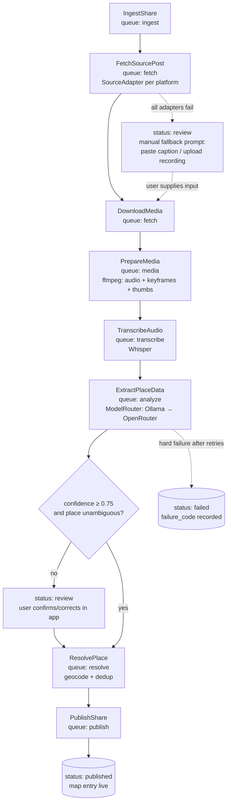

# 04 — Analysis Pipeline

Spec for the Reelmap share-processing pipeline: from a shared video URL to a published, geocoded map entry. Implemented as a Laravel 13 chained job pipeline on Redis queues, supervised by Horizon. Postgres+PostGIS is the system of record; media lives on Cloudflare R2 (S3-compatible); the extraction contract lives at `packages/contracts/extraction.schema.json` (§4).

Cross-references: data model in `02-data-model.md`, platform ingestion details in `03-ingestion.md`, review UI in `05-mobile-app.md`.

---

## 1. Pipeline overview

A `Share` row is created when the user shares a URL into the app (share extension, paste, or manual upload). Processing is a **job chain** (`Bus::chain`) so stages run strictly in order per share; distinct shares process in parallel. Share status walks `pending → fetching → analyzing → review → published` (or `failed` at any point).



### Stage contracts

All jobs share these conventions:

- **Idempotency**: every job checks for its own completed output before doing work and returns early if present (safe on Horizon retry/duplicate delivery). Stage outputs are keyed by `share_id` + stage name.
- **State transitions** are guarded: a job first asserts the share is in the expected status; if not (e.g. user cancelled, another worker completed it), it exits silently.
- **Failure**: on final failure (`failed()` hook), set `shares.status = failed`, record `failure_code` + `failure_detail` (taxonomy in §8), release any locks, notify the user via push.
- **Locking**: chain start acquires `Cache::lock("share:{id}")` semantics implicitly via chain ordering; `ResolvePlace` additionally takes a distributed lock per candidate place (see §6).

| Job | Queue | Inputs | Outputs | Tries | Backoff | Timeout |
|---|---|---|---|---|---|---|
| `IngestShare` | `ingest` | raw URL, user_id | normalized `shares` row (canonical URL, platform enum), status→`fetching`, dispatches chain | 3 | 5s, 30s, 120s | 30s |
| `FetchSourcePost` | `fetch` | share | `source_posts` row (caption, author handle/display name, posted_at, media URLs, raw payload JSON) | 4 | 30s, 2m, 10m, 30m | 120s |
| `DownloadMedia` | `fetch` | source_post media URLs | `media_assets` rows (`kind: video\|image`), bytes streamed to R2 `media/{share_id}/original/…` | 3 | 1m, 5m, 15m | 600s |
| `PrepareMedia` | `media` | original video asset | `media_assets` rows: `audio` (16 kHz mono WAV), `keyframe` ×≤12, `thumbnail`; keyframe timestamps stored in asset meta | 2 | 2m, 10m | 600s |
| `TranscribeAudio` | `transcribe` | audio asset | transcript text + segments (start/end/text) + detected language, stored on `source_posts.transcript_json` | 3 | 1m, 5m, 15m | 900s |
| `ExtractPlaceData` | `analyze` | caption + transcript + keyframes | `analysis_runs` row (engine, model, cost, confidence, `result_json` valid against schema) | 3 | 30s, 3m, 10m | 600s |
| `ResolvePlace` | `resolve` | winning analysis run | `places` row (new or existing) + `place_sources` link; or share→`review` if ambiguous | 3 | 10s, 1m, 5m | 60s |
| `PublishShare` | `publish` | resolved place + share | status→`published`, map entry visible, attribution rendered, push notification | 3 | 5s, 30s, 2m | 30s |

Stage-specific notes:

- **IngestShare**: expands shortlinks (`vm.tiktok.com`, `youtu.be`, `t.co`), strips tracking params, dedups — if the same user already shared this canonical URL, short-circuit to the existing share. If any user already published it, skip straight to `ResolvePlace` attach logic (reuse latest passing `analysis_runs`).
- **FetchSourcePost**: selects adapter via `SourceAdapter::supports()` (§2), walks the adapter fallback chain. Rate-limited per platform via Laravel `RateLimited` job middleware (e.g. `instagram: 30/min` app-wide). A `429`/`403` releases with the platform's `Retry-After` when present.
- **DownloadMedia**: streams (never buffers whole file in memory); enforces max 500 MB / 15 min duration; stores `sha256` on the asset for dedup. Re-run safe: skips assets whose checksum already exists on R2.
- **PrepareMedia** (ffmpeg, spawned via `Process` with the job timeout):
  - Audio: `ffmpeg -i in.mp4 -vn -ac 1 -ar 16000 -c:a pcm_s16le audio.wav`. If the video has no audio track, write asset meta `no_audio: true` and let `TranscribeAudio` no-op.
  - Keyframes: scene detection `select='gt(scene,0.3)'` targeting ~1 frame per 2–3 s of runtime, **hard cap N=12**; if scene detection yields <4 frames, fall back to uniform sampling `fps=1/(duration/8)`. JPEG quality 85, longest edge 1024 px, named `frame_{index}_{ms}.jpg` — `frame_refs` in the extraction schema use these indexes.
  - Thumbnail: sharpest of first 3 keyframes (max Laplacian variance via a tiny ffmpeg/imagick pass), 640 px.
- **TranscribeAudio**: whisper.cpp binary (default) or Ollama-hosted Whisper — same `Transcriber` contract, driver chosen by `TRANSCRIBER_DRIVER`. Language auto-detected; store `language` + per-segment timestamps. Empty/music-only audio yields empty transcript, not failure.
- **ExtractPlaceData**: see §3–§5. Retries here mean *transport* retries; JSON-repair attempts happen inside one job execution.
- **ResolvePlace / PublishShare**: see §6. `PublishShare` writes the denormalized map entry, links `place_sources` (share, source_post, influencer attribution, dish list), and marks first-publisher credit.

---

## 2. SourceAdapter contract

```php
namespace App\Ingestion;

interface SourceAdapter
{
    /** Fast, offline check — can this adapter handle the canonical URL? */
    public function supports(string $canonicalUrl): bool;

    /**
     * Caption, author, posted_at, media descriptors. MUST NOT download media bytes.
     * @throws FetchFailed (transient) | PostUnavailable (permanent: deleted/private-without-auth)
     */
    public function fetchMetadata(string $canonicalUrl, ?LinkedAccount $account): SourcePostData;

    /** Resolved, short-lived direct media URLs (or local temp paths for yt-dlp). */
    public function fetchMedia(SourcePostData $post, ?LinkedAccount $account): MediaFetchResult;

    /** True if this adapter can only work with a linked platform account. */
    public function requiresAuth(): bool;
}
```

`SourcePostData` DTO: `platform, external_id, url, caption, author_handle, author_display_name, posted_at, media[] (type, url|null, width, height, duration), raw (json)`.

### Adapters and fallback chains

Adapter selection: `AdapterRegistry` iterates registered adapters in priority order for the share's platform; first `supports() === true` wins. On `FetchFailed`/`PostUnavailable`, `FetchSourcePost` advances to the next entry in the platform's chain. Every chain terminates in **ManualUpload**.

| Platform | Chain (in order) |
|---|---|
| Instagram | 1. `InstagramOEmbedAdapter` (public posts; caption + thumbnail only, no video URL) → 2. `InstagramGraphAdapter` (user's linked token; full media, works for their private-visible posts; `requiresAuth`) → 3. `InstagramYtDlpAdapter` (yt-dlp fetcher, feature-flagged `INGEST_YTDLP_ENABLED`) → 4. ManualUpload |
| X | 1. `XApiAdapter` (linked token when present, app token otherwise) → 2. `XYtDlpAdapter` → 3. ManualUpload |
| TikTok | 1. `TikTokOEmbedAdapter` (caption/author) → 2. `TikTokYtDlpAdapter` (media) → 3. ManualUpload |
| YouTube | 1. `YouTubeDataApiAdapter` (metadata; API key) → 2. `YouTubeYtDlpAdapter` (media; Shorts included) → 3. ManualUpload |
| unknown/other | ManualUpload |

Notes:

- Metadata and media may come from **different** adapters (e.g. Instagram oEmbed caption + yt-dlp video). `FetchSourcePost` merges: first successful metadata wins; `DownloadMedia` uses the first adapter in the chain that returns media.
- `ManualUploadAdapter` is passive: it flips the share to `review` with `review_reason: fetch_failed` and the app prompts the user to paste the caption and upload a screen recording. When the user submits, the API re-dispatches the chain from `DownloadMedia` (user upload becomes the original `media_asset`; pasted caption becomes `source_posts.caption`, `raw.source: manual`).
- yt-dlp adapters run the binary in an isolated worker with 120 s process timeout, no cookies unless the user linked an account and consented; output piped to a temp file then streamed to R2.

---

## 3. Model orchestration — local-first, remote fallback

`App\Ai\ModelRouter` is the single entry point for LLM calls. It owns engine choice, health checks, structured-output enforcement, cost accounting.

### Routing algorithm (per `ExtractPlaceData` run)

1. Resolve user preference `users.ai_model_pref` (default `'auto'`). If the user pinned a specific OpenRouter model, skip to step 4 with it.
2. **Ollama health check**: `GET {OLLAMA_URL}/api/tags`, 2 s timeout, result cached 30 s. Unreachable → fallback (reason `ollama_unreachable`).
3. **Local attempt** against Ollama (`/api/chat`, `format: "json"` + schema-in-prompt):
   - Vision-capable model for keyframes + text: default `OLLAMA_VISION_MODEL=qwen2.5-vl:7b` (alternative: `llava:13b`).
   - Optional text-only pass model `OLLAMA_TEXT_MODEL=qwen2.5:14b` used when the share has no usable keyframes.
   - Request timeout `OLLAMA_TIMEOUT=180s`.
4. **Fallback to OpenRouter** (`POST /api/v1/chat/completions`, multimodal `image_url` parts with base64 data URIs of keyframes, `response_format: {type: json_schema}` where the model supports it) when any trigger fires:
   - Ollama unreachable / health check failed
   - Generation error or timeout from Ollama
   - Output still fails schema validation after the 2-attempt repair loop (§5)
   - Parsed result has `confidence.overall < 0.5` (local model unsure → escalate)
   - Default fallback model `OPENROUTER_DEFAULT_MODEL` (curated list below); user pin overrides.
5. Every attempt — including failed ones — writes an `analysis_runs` row: `engine (local|openrouter)`, `model`, `status`, `fallback_reason`, `prompt_tokens`, `completion_tokens`, `cost_usd` (0 for local), `confidence`, `result_json`, `duration_ms`. The share links to the **winning** run via `shares.analysis_run_id`.

### Model listing endpoint

`GET /api/v1/models` (authed) returns the merged catalog the app's model picker renders:

- Local: live `GET {OLLAMA_URL}/api/tags`, filtered to models tagged vision-capable in config; `cost: 0`, `engine: local`.
- Remote: curated allowlist from `config/ai.php` (`openrouter.curated_models`) — vision-capable, JSON-reliable models with display name and price per Mtok (e.g. `anthropic/claude-sonnet-*`, `google/gemini-*-flash`, `openai/gpt-*o-mini`, `qwen/qwen2.5-vl-72b-instruct`). Curated, not the raw OpenRouter list, so the picker never offers a model the pipeline can't drive.
- First entry is always `auto` (recommended, default).

### Cost caps

- **Per-run max**: estimated cost (prompt size × model price) must be ≤ `AI_MAX_COST_PER_RUN` (default $0.10) or the router downgrades to the cheapest curated model; if still over, run fails with `cost_cap_exceeded`.
- **Per-user daily quota**: `AI_DAILY_USER_BUDGET` (default $0.50) tracked by summing `analysis_runs.cost_usd` for the user today (Redis counter + nightly reconcile). Over quota → local-only; if local unavailable, share parks in `review` with `review_reason: quota_exhausted` and auto-retries after midnight UTC.
- All spend is queryable from `analysis_runs` — no separate ledger.

---

## 4. Extraction JSON Schema (canonical contract)

Canonical file: `packages/contracts/extraction.schema.json`. The block below **is** that file; any change must land there first and be mirrored here. Golden rule encoded throughout: **every field is nullable-or-empty rather than guessed** — models are instructed (§5) to emit `null` / `[]` when the source doesn't support a value.

```json
{
  "$schema": "http://json-schema.org/draft-07/schema#",
  "$id": "https://reelmap.app/contracts/extraction.schema.json",
  "title": "ReelmapExtraction",
  "type": "object",
  "additionalProperties": false,
  "required": ["place", "influencer", "post", "evidence", "confidence"],
  "properties": {
    "place": {
      "type": "object",
      "additionalProperties": false,
      "required": ["name", "category", "cuisines", "address", "geo", "price_range",
                   "phone", "website", "opening_hours_text", "dishes", "vibe_tags", "dietary_tags"],
      "properties": {
        "name": { "type": ["string", "null"], "description": "Restaurant/venue name exactly as stated in the source. null if not identifiable." },
        "category": {
          "type": ["string", "null"],
          "enum": ["restaurant", "cafe", "bar", "bakery", "street_food", "food_truck",
                   "dessert", "market", "other", null]
        },
        "cuisines": { "type": "array", "items": { "type": "string" }, "description": "Lowercase cuisine labels, e.g. \"thai\", \"neapolitan pizza\". Empty if unstated." },
        "address": {
          "type": "object",
          "additionalProperties": false,
          "required": ["street", "city", "region", "postal_code", "country"],
          "properties": {
            "street":      { "type": ["string", "null"] },
            "city":        { "type": ["string", "null"] },
            "region":      { "type": ["string", "null"], "description": "State/province/prefecture." },
            "postal_code": { "type": ["string", "null"] },
            "country":     { "type": ["string", "null"], "description": "ISO 3166-1 alpha-2 when confidently known, else full name, else null." }
          }
        },
        "geo": {
          "type": ["object", "null"],
          "additionalProperties": false,
          "required": ["lat", "lng"],
          "properties": {
            "lat": { "type": "number", "minimum": -90, "maximum": 90 },
            "lng": { "type": "number", "minimum": -180, "maximum": 180 }
          },
          "description": "Only when explicit coordinates appear in the source (e.g. geotag text). Never inferred."
        },
        "price_range": { "type": ["integer", "null"], "minimum": 1, "maximum": 4, "description": "1=$ … 4=$$$$. null if unstated." },
        "phone":   { "type": ["string", "null"] },
        "website": { "type": ["string", "null"], "format": "uri" },
        "opening_hours_text": { "type": ["string", "null"], "description": "Verbatim hours text from the source, unparsed." },
        "dishes": {
          "type": "array",
          "items": {
            "type": "object",
            "additionalProperties": false,
            "required": ["name", "shown_in_video"],
            "properties": {
              "name": { "type": "string", "minLength": 1 },
              "shown_in_video": { "type": "boolean", "description": "true only if the dish visibly appears in the keyframes/video." }
            }
          }
        },
        "vibe_tags":    { "type": "array", "items": { "type": "string" }, "description": "e.g. \"cozy\", \"date night\", \"counter seating\", \"late night\"." },
        "dietary_tags": { "type": "array", "items": { "type": "string" }, "description": "e.g. \"vegan options\", \"halal\", \"gluten-free\". Only when stated or clearly shown." }
      }
    },
    "influencer": {
      "type": "object",
      "additionalProperties": false,
      "required": ["platform", "handle", "display_name"],
      "properties": {
        "platform":     { "type": ["string", "null"], "enum": ["instagram", "x", "tiktok", "youtube", null] },
        "handle":       { "type": ["string", "null"] },
        "display_name": { "type": ["string", "null"] }
      }
    },
    "post": {
      "type": "object",
      "additionalProperties": false,
      "required": ["language", "caption_summary", "is_sponsored_disclosure"],
      "properties": {
        "language": { "type": ["string", "null"], "description": "BCP-47 primary language of the post content, e.g. \"en\", \"pt-BR\"." },
        "caption_summary": { "type": ["string", "null"], "maxLength": 500 },
        "is_sponsored_disclosure": { "type": "boolean", "description": "true if #ad, #sponsored, paid-partnership label, or equivalent disclosure is present." }
      }
    },
    "evidence": {
      "type": "object",
      "additionalProperties": false,
      "required": ["caption_quotes", "transcript_quotes", "frame_refs"],
      "properties": {
        "caption_quotes":    { "type": "array", "items": { "type": "string" }, "description": "Verbatim caption substrings supporting the extraction." },
        "transcript_quotes": { "type": "array", "items": { "type": "string" } },
        "frame_refs":        { "type": "array", "items": { "type": "integer", "minimum": 0, "maximum": 11 }, "description": "Indexes of supporting keyframes as provided in the prompt." }
      }
    },
    "confidence": {
      "type": "object",
      "additionalProperties": false,
      "required": ["overall", "per_field"],
      "properties": {
        "overall": { "type": "number", "minimum": 0, "maximum": 1 },
        "per_field": {
          "type": "object",
          "description": "Map of dotted field path (e.g. \"place.name\", \"place.address.city\") to confidence 0-1.",
          "additionalProperties": { "type": "number", "minimum": 0, "maximum": 1 }
        }
      }
    }
  }
}
```

Server-side validation uses `opis/json-schema` against this exact file. A payload that validates but has `place.name = null` is treated as "no place found" → share goes to `review` with `review_reason: no_place_extracted`.

---

## 5. Prompting strategy

### Message assembly (multimodal)

- **System prompt** (template `resources/prompts/extraction.system.md`, versioned; version string recorded on `analysis_runs.prompt_version`):

  > You extract structured restaurant data from social-media food videos. You receive: numbered keyframe images (frame 0..N-1), the post caption, and an audio transcript. Return ONLY a JSON object valid against the provided schema — no markdown, no commentary.
  > Rules: (1) Never invent data. If the caption, transcript, and frames do not state or clearly show a value, output null (or [] for arrays). A null is correct; a guess is a defect. (2) Quote evidence verbatim in `evidence`; every non-null high-stakes field (name, address parts, geo) must be supported by at least one quote or frame ref. (3) `geo` only from explicit coordinates in the source — never estimate from imagery. (4) `dishes[].shown_in_video` is true only when the dish is visible in a frame. (5) Detect the post language; write `caption_summary` in English regardless. (6) Score `confidence.per_field` honestly; `overall` should reflect whether a human could pin this place on a map from your output alone.

- **User message parts**: keyframe images in index order (each preceded by a text part `frame {i} @ {mm:ss}`), then `CAPTION:` block, then `TRANSCRIPT:` block (segment timestamps included), then the full JSON Schema inline, then: `Respond with a single JSON object valid against the schema above.`

### Structured-output enforcement

- Ollama: `format: "json"` (or full `format: <schema>` on versions supporting grammar-constrained decoding).
- OpenRouter: `response_format: { "type": "json_schema", "json_schema": {...}, "strict": true }` when the model supports it; else `{"type": "json_object"}` + schema-in-prompt.
- Post-parse, the payload is validated against §4 regardless of engine — provider "strict" modes are treated as best-effort.

### Repair loop (max 2 attempts, inside one job execution)

1. Attempt to parse; strip common wrappers first (```json fences, leading prose) via a tolerant extractor that takes the first balanced `{…}` block.
2. If parse or schema validation fails → **repair attempt 1**: re-send the same conversation plus the model's raw output and a message: `Your previous output failed validation: {validator errors}. Return the corrected JSON object only.`
3. Still failing → **repair attempt 2**, same shape, temperature 0.
4. Still failing → this engine's attempt is dead: local → trigger OpenRouter fallback (§3); OpenRouter → job failure `invalid_model_output` (retried per §1 policy; final failure → share `failed`).

### Language handling

- Transcript language from Whisper and `post.language` from the model are stored separately; mismatch is fine (caption pt-BR, speech en).
- All extraction output values keep source language **except** `caption_summary` (English) and tag arrays (lowercase English vocabulary where a clear translation exists; otherwise transliterated source term).
- Place `name` stays in native script; ResolvePlace passes it to the Geocoder as-is (Google Places handles native-script queries well).

---

## 6. ResolvePlace stage

### Geocoder contract

```php
namespace App\Geo;

interface Geocoder
{
    /**
     * @param GeoHints $hints  address parts, city, country, optional lat/lng bias, language
     * @return GeocodeResult|null  { google_place_id, canonical_name, formatted_address,
     *                               address_components, lat, lng, types[], score 0-1 }
     */
    public function findPlace(string $name, GeoHints $hints): ?GeocodeResult;
}
```

Default binding: `GooglePlacesGeocoder` (Places API *Find Place* + *Place Details*, field-masked). The contract keeps the pipeline provider-agnostic (test double: `FakeGeocoder`). Results cached 30 days keyed by normalized `(name, city, country)`.

### Dedup decision tree

Run under `Cache::lock('resolve:'.md5(google_place_id ?? name+city))` (30 s) to prevent duplicate canonical places from concurrent shares.

1. **Geocode**: `findPlace(place.name, hints from address/geo/post language)`.
2. **`google_place_id` exact match** against `places.google_place_id` → attach: create `place_sources` row (share, source_post, influencer, analysis_run, dishes), done.
3. **No place_id match, geocode succeeded** → PostGIS candidate scan:
   `SELECT … FROM places WHERE ST_DWithin(location::geography, ST_MakePoint(:lng,:lat)::geography, 75)`
   For each candidate, name similarity = max(trigram `similarity()`, normalized-token Jaro-Winkler) on accent-folded, lowercased names.
   - Best candidate has distance <75 m **and** similarity ≥0.85 → attach as `place_source`; backfill `google_place_id` if the existing place lacks one.
   - Multiple candidates ≥0.85 within 75 m → **ambiguous** → share status `review`, `review_reason: ambiguous_place`, candidates stored on the share for the picker UI.
4. **No candidate matched, geocode succeeded** → create `places` row `status: pending` (published to the map immediately but flagged unverified until a second independent source or a user confirmation) + `place_source`.
5. **Geocode returned null or low score (<0.5)** → share status `review`, `review_reason: geocode_failed`; user can adjust name/city and retry, or drop a pin manually.

`places.location` is `geography(Point,4326)`; `place_sources` is unique on `(place_id, source_post_id)` for idempotency.

---

## 7. User review step

A share enters `review` (instead of proceeding automatically) when any of:

- `confidence.overall < 0.75`
- `review_reason: ambiguous_place | geocode_failed | no_place_extracted | fetch_failed | quota_exhausted`

App behavior: push notification → editable extraction sheet (name, category, cuisines, address, price, dishes, tags) pre-filled from `result_json`, with the evidence quotes and keyframes shown alongside; ambiguous case shows the candidate list on a mini-map. User taps **Confirm** (possibly after edits) → API stores the correction as a `share_corrections` row (`field_path`, `model_value`, `user_value`) and re-dispatches from `ResolvePlace` with the corrected payload. **Discard** → share `failed` with `failure_code: user_discarded`.

Corrections are ground truth: they feed prompt-regression evals and per-model accuracy dashboards (join `share_corrections` × `analysis_runs.model`), and are the future fine-tuning corpus. Never overwrite the original `result_json` — corrected payload is stored separately on the share.

## 8. Observability

- **Timing**: each job records `duration_ms` per share stage in a `share_stage_metrics` table (share_id, stage, started_at, duration_ms, attempt); p50/p95 per stage on the ops dashboard. `analysis_runs.duration_ms` covers model latency specifically.
- **Failure taxonomy** (`shares.failure_code`, also emitted as a metric label): `fetch_unavailable`, `fetch_auth_required`, `media_too_large`, `ffmpeg_error`, `transcribe_error`, `ollama_unreachable`, `invalid_model_output`, `cost_cap_exceeded`, `geocode_failed`, `resolve_conflict`, `user_discarded`, `unknown`. Alert when any code exceeds 5% of shares over 15 min.
- **Horizon**: queues as in §1 table with per-queue worker pools (`media`/`transcribe` on CPU-heavy workers, `analyze` low-concurrency). Jobs tag themselves `share:{id}`, `user:{id}`, `platform:{x}`, `stage:{name}`, `engine:{local|openrouter}` for Horizon search.
- **Cost dashboard**: nightly rollup of `analysis_runs` (spend by engine/model/user/day, fallback-rate, local-vs-remote share, avg cost per published place). Fallback rate >30% sustained means local models or Ollama capacity need attention — alert.
- Logs are structured (JSON) with `share_id` as the correlation key across every stage.
