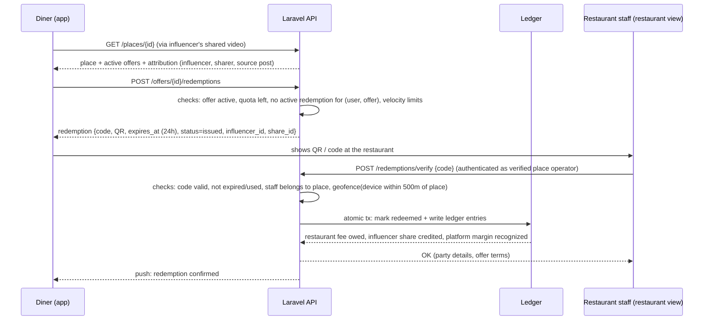

# 06 — Monetization

Status: canonical spec for build agents. Depends on: 01-architecture.md, 02-data-model.md (offers, redemptions, ledger_entries, payouts, place_claims), ROADMAP.md (phase M4).

## 1. Business Model Overview

Reelmap monetizes a two-sided incentive loop built on influencer attribution:

1. **Influencer** posts a restaurant video (Instagram/X/TikTok/YouTube). A user shares it into Reelmap; the place is pinned with attribution to the influencer (`source_posts.influencer_id`) and the sharer (`shares.user_id`).
2. **Diner** discovers the place via the map/feed, sees an active offer, and requests a redemption tied to that share.
3. **Restaurant** honors the offer and pays only for **measurable, seated visits** (verified redemptions) — TheFork-style pay-per-cover mechanics, adapted so each visit is attributed to a specific influencer and share.
4. **Platform** takes a fee per redemption and pays the influencer a revenue share, closing the loop: influencers are financially motivated to have their content on Reelmap, which grows supply of places and demand from diners.

Key differences vs. TheFork: no booking engine in v1 (offer + walk-in redemption instead of reservations), and the payable event is a **verified redemption**, not a booking. Attribution chain per redemption: `redemptions.influencer_id` + `redemptions.share_id` → `shares.source_post_id` → `source_posts.influencer_id`.

## 2. Restaurant Program

### 2.1 Place claiming & verification (`place_claims`)

A restaurant operator claims a `place` before creating offers.

| Method | Mechanism | Automation |
|---|---|---|
| `phone` | Robocall/SMS to the Google-Places-listed phone number with a 6-digit code; operator enters code in app | Fully automated |
| `website` | Meta tag or `/.well-known/reelmap-verify.txt` containing claim token on the place's listed domain; backend fetch verifies | Fully automated |
| `document` | Upload business registration / utility bill; reviewed in Filament admin queue | Manual review, SLA 2 business days |

Rules:
- `place_claims.status`: `pending` → `verified` | `rejected`. One `verified` claim per place; competing claims escalate to admin.
- A verified claim links `place_claims.user_id` as the place operator; grants access to the restaurant view (offer management, redemption scanner, stats).
- Re-verification required if the operator account is inactive 12 months or ownership is disputed.

### 2.2 Offer creation

Verified operators create `offers`:

| Field | Values / constraints |
|---|---|
| `type` | `discount_percent` (5–50%), `discount_fixed` (amount + currency), `freebie` (free item, text description) |
| `valid_from` / `valid_until` | Validity window; max 90 days per offer, renewable |
| `quota_total` / `quota_per_day` | Hard caps; redemptions stop issuing when exhausted |
| `min_party_size` / `max_party_size` | Optional |
| `schedule` | Optional day-of-week/time windows (e.g. Mon–Thu, off-peak) |
| `terms` | Free-text terms shown to diner before issuing redemption |
| `status` | `draft` → `active` → `paused` \| `expired` \| `archived` |

Offers are moderated post-hoc (admin can pause any offer); no pre-approval gate in v1.

### 2.3 Pricing model

Options considered:

| Model | Pros | Cons |
|---|---|---|
| **Flat fee per seated redemption (€2–4)** | Trivially explainable; no bill data needed; predictable for restaurant | Undervalues large parties |
| % of bill | Scales with value | Requires bill capture → friction + fraud surface + POS integration |
| Monthly subscription | Predictable revenue | Wrong for cold start; restaurants won't pay before proven demand |

**Decision (v1): flat pay-per-redemption fee, default €3.00, configurable per offer program in range €2.00–€4.00.** No charge for issued-but-expired redemptions — only `redeemed` status is billable. A **free listing tier always exists**: any place extracted from shared videos appears on the map with attribution at no cost; restaurants pay only when they opt into the offer program. % of bill and booking-based pricing are deferred (see §7).

Billing: restaurant fees accrue in the ledger and are invoiced/charged monthly via Stripe (card or SEPA on file, collected at first offer activation). Restaurants prepay nothing.

## 3. Attribution & Redemption Flow

Implementation notes:
- Redemption `code`: 8-char Crockford base32, unique, single-use; QR encodes a signed URL variant of the same code.
- Verify endpoint is idempotent on `code`; second call returns the prior result.
- Redemption row stores denormalized `influencer_id` and `share_id` at issue time so attribution is immutable even if the share is later deleted.

### Anti-fraud controls (v1, all enforced at issue or verify time)

| Control | Rule |
|---|---|
| One active redemption per user/offer | Unique partial index on (`user_id`, `offer_id`) where `status = issued` |
| Geofence at verify | Verifying staff device must report location within 500 m of `places.location` (PostGIS `ST_DWithin`); failures logged + flagged, admin-overridable |
| Velocity limits | Per diner: max 3 issues/day, 10/week. Per offer: `quota_per_day`. Per verifying staff account: max 30 verifies/hour, alert threshold in admin |
| Restaurant-side auth | `/redemptions/verify` requires Sanctum token of a user with a `verified` claim on that place |
| Cooldown | Same diner cannot redeem at the same place more than once per 7 days |
| Self-dealing | Diner account = place operator account → blocked; operator redeeming their own influencer's offers → flagged |

## 4. Revenue Share Mechanics

### 4.1 Split

- Restaurant pays flat fee `F` per redemption (default €3.00).
- Platform net fee = `F` (no processing deduction modeled per-redemption; Stripe costs absorbed at payout/invoice level in v1).
- **Influencer share = 50% of platform net fee** (v1 default; configurable per offer program via `revenue_share_bps`, stored on the offer at creation — changes never retroactive).
- Sharer (the user who shared the video) earns nothing monetary in v1 — social credit only (leaderboards, badges; see 04-social). Revisit later.

### 4.2 Double-entry ledger rules (`ledger_entries`)

Accounts: `restaurant_receivable:{place_id}`, `platform_revenue`, `influencer_payable:{influencer_id}`, `influencer_escrow:{influencer_id}` (unclaimed), `platform_cash`, `payout_clearing`.

Every business event writes balanced entries in one DB transaction. Example for one redemption at €3.00, 50% share, claimed influencer:

| # | Event | Debit | Credit | Amount |
|---|---|---|---|---|
| 1 | Redemption verified | restaurant_receivable:place_42 | platform_revenue | €3.00 |
| 2 | Influencer share accrued | platform_revenue | influencer_payable:inf_7 | €1.50 |
| 3 | Monthly invoice paid by restaurant | platform_cash | restaurant_receivable:place_42 | €3.00 |
| 4 | Payout run transfer | influencer_payable:inf_7 | payout_clearing | (balance) |
| 5 | Stripe transfer confirmed | payout_clearing | platform_cash | (balance) |

If the influencer is unclaimed at redemption time, entry 2 credits `influencer_escrow:{influencer_id}` instead; on claim, escrow balance moves to `influencer_payable` in one entry.

Invariants (enforced by service layer + nightly job): sum(debits) = sum(credits) per transaction group; account balances never computed outside ledger; no updates/deletes to `ledger_entries` — corrections are reversing entries.

### 4.3 Payouts

- **Rail:** Stripe Connect **Express** accounts for influencers; platform triggers `Transfer`s. Stripe handles KYC/onboarding (hosted onboarding link surfaced in influencer dashboard). No payout until `charges_enabled`/`payouts_enabled` on the connected account.
- **Minimum threshold:** €25.00 payable balance. Below threshold, balance rolls over.
- **Cadence:** monthly payout run (1st business day), Laravel scheduled command: select influencers with payable ≥ threshold and completed KYC → create `payouts` row (`pending`) → Stripe transfer → webhook confirms → `paid` + ledger entries 4–5. Failures → `failed`, balance restored, admin alert.
- **Currency:** EUR only in v1.

### 4.4 Refunds / voids

- Restaurant disputes a redemption within 7 days (wrong scan, no-show after scan) → admin or auto-rule voids it: reversing entries for 1 and 2; if influencer already paid out, negative balance carried against future earnings (no clawback transfers in v1).
- Void after invoice → credit note on next invoice.

## 5. Influencer Program

### 5.1 Identity claiming

`influencers` rows are created automatically from `source_posts` authors and are **claimable** (`influencers.claimed_by_user_id`, null until claimed). Verification methods:

1. **Code-in-bio:** app generates one-time token; influencer places it in their platform bio (or a pinned post); backend fetches profile and matches → claim verified. Works on all four platforms; primary method.
2. **Platform OAuth:** where the user has already connected a `platform_accounts` row via OAuth for the same platform handle (realistic today only for platforms with viable OAuth — Instagram Basic Display is dead; treat as best-effort secondary method).

Disputes (two people claiming one influencer identity) → manual admin review in Filament. Claiming retroactively grants all escrowed earnings (§5.3).

### 5.2 Influencer dashboard (app + web)

Funnel metrics per influencer, per place, and per source post:

`shares` → place page views (attributed) → offer taps → redemptions issued → redemptions redeemed → earnings.

Plus: pending balance, paid-out total, payout history, Stripe onboarding status, top places by earnings.

### 5.3 Unclaimed influencer earnings

- Accrue to `influencer_escrow:{influencer_id}` in the ledger (§4.2). Money is real and reserved — this is the growth hook ("you have €212 waiting — claim your profile").
- **Expiry policy:** escrow older than **12 months** (per-entry aging) is swept to `platform_revenue` via reversing entry. Claim during the window transfers the full escrow balance to `influencer_payable`.
- Outreach: M4+ optional automated notification (comment/DM by ops team, not automated scraping) — ops decision, out of engineering scope.

## 6. Unit Economics Sanity Check

Scenario: one restaurant, one month, 100 verified redemptions at €3.00 flat fee, 50% influencer share.

| Line | Amount |
|---|---|
| Restaurant pays (100 × €3.00) | €300.00 |
| Influencer share (50%) | −€150.00 |
| Platform gross margin | €150.00 |
| Stripe costs (invoice charge ~1.5% + €0.25; transfer/payout ~€0.35 avg amortized) | ≈ −€5.35 |
| AI/geocoding/infra attributable (~€0.02/redemption incl. ingest amortization) | ≈ −€2.00 |
| **Platform net contribution** | **≈ €142.65 (~48% of restaurant spend)** |

Restaurant side: 100 incremental visits at avg €25 bill = €2,500 revenue for €300 fee + discount cost (e.g. 15% avg discount ≈ €375) → CAC-equivalent ≈ €6.75/visit — competitive vs. paid social. Influencer side: a mid-size influencer driving 100 redemptions/month earns €150/month passively per restaurant — meaningful at 5–10 restaurants. Model holds; sensitivity worth re-checking when avg fee < €2 or share > 60%.

## 7. Phase Mapping

| Capability | Phase |
|---|---|
| Place claiming + verification (phone/website/doc), restaurant view | **M4** |
| Offers CRUD, redemption issue/verify, QR scanner, anti-fraud v1 | **M4** |
| Double-entry ledger, escrow, void/refund flow | **M4** |
| Stripe Connect Express onboarding, manual-trigger payout run | **M4** |
| Influencer claim flow (code-in-bio) + dashboard funnel | **M4** |
| Monthly restaurant invoicing automation | **M4 (can ship late in phase)** |
| Fully automated scheduled payout runs (no human approval) | **Post-M5** |
| % of bill pricing, POS integration | **Later (not scheduled)** |
| Booking/reservation integration (TheFork-style covers) | **Later (not scheduled)** |
| Sharer monetary rewards, multi-currency payouts | **Later (not scheduled)** |
