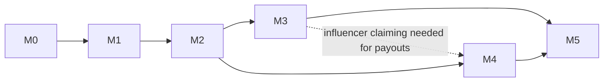

# Reelmap — Roadmap

> How to read this file: phases are strictly ordered (M0 → M5). A phase is **done** when every task tagged with it in `tasks/tasks.json` has `status: "done"` and the exit criteria below pass. Agents: always work the lowest incomplete phase; within it, pick any task whose `depends_on` are all done.

## Phase overview

| Phase | Name | Goal (one line) | Depends on |
|-------|------|-----------------|------------|
| M0 | Foundations | Monorepo, Laravel 13 API + Expo app scaffolds, auth, CI — a logged-in user on a phone talking to the API | — |
| M1 | Ingest & Analyze | The core loop: share a reel from Instagram → async AI pipeline → confirmed place entry | M0 |
| M2 | Map & Discovery | Places on a clustered map, place pages, tags, search, feed, dedup review | M1 |
| M3 | Social | Public profiles, influencer identities & claiming, follows, notifications center | M2 |
| M4 | Monetization | Restaurant claims & offers, QR redemptions with attribution, double-entry ledger, Stripe Connect payouts | M2 (M3 for influencer claiming) |
| M5 | Hardening & Launch | Moderation, GDPR, observability, E2E tests, store submission, production deploy | M1–M4 |

## M0 — Foundations

**Outcome:** a developer (or agent) can run the API and the mobile app locally; a user can register, log in, and see an authenticated home screen. CI is green.

Scope: monorepo scaffold; Laravel 13 API (resolve latest stable versions at scaffold time); Postgres + PostGIS; Sanctum auth; Redis + Horizon; Filament admin; Expo app (latest SDK, expo-router, dev client); `packages/contracts` with the extraction JSON schema + generated TS types; S3/R2 storage config; GitHub Actions CI.

**Exit criteria**
- `apps/api`: `composer test` (Pest) green, `pint --test` and `phpstan` clean; `/api/v1/auth/*` + `/api/v1/me` working.
- `apps/mobile`: `tsc --noEmit`, eslint, jest green; login/register flow works against local API on iOS simulator + Android emulator (dev client build).
- `packages/contracts/extraction.schema.json` validates sample payloads in both PHP (API test) and TS (mobile test).
- CI runs all of the above on every push.

## M1 — Ingest & Analyze (the core loop)

**Outcome:** share an Instagram reel URL into the app (share sheet or paste) → pipeline fetches, transcribes, extracts, geocodes → user confirms/corrects → published place entry with attribution. Local model (Ollama) first, OpenRouter fallback with user-selectable model.

Scope: migrations for influencers/source_posts/shares/media_assets/analysis_runs/places/place_sources; `SourceAdapter` interface + Instagram (oEmbed/yt-dlp), X, TikTok/YouTube, Manual adapters; Instagram account linking (OAuth) for private posts; job chain (Fetch → DownloadMedia → PrepareMedia → Transcribe → Extract → ResolvePlace → Publish); ModelRouter (Ollama health-check + OpenRouter fallback + `GET /models`); Geocoder contract (Google Places impl); share status API; mobile share-intent, status, and extraction-review screens; push notification on completion.

**Exit criteria**
- Integration test: fake adapter + fake model → share goes `pending → … → published` and creates a place with a PostGIS point.
- Real-world smoke: a public Instagram reel URL produces a confirmed place entry end-to-end on a device.
- Killing Ollama mid-run causes a recorded OpenRouter fallback run (`analysis_runs` rows for both attempts, with cost).
- Low-confidence extraction routes to `review` status and the mobile review screen can correct + publish it.

## M2 — Map & Discovery

**Outcome:** every published place is discoverable: clustered map driven by viewport, place detail pages with source videos + attribution, tag/cuisine/price filters, text search, a basic feed. Duplicate places get merged.

Scope: `GET /map/places` bbox query with clustering; places index/show; tags + Scout/Meilisearch; mobile Map, Place detail, Search, Feed screens; Filament dedup/merge review queue.

**Exit criteria**
- Map at city zoom returns clusters in <300ms p95 with 10k seeded places.
- Two shares of the same restaurant (different posts) attach to one place; a wrong merge can be undone in Filament.
- Place detail shows: extracted data, every source post (link-out to original), influencer, sharer.

## M3 — Social

**Outcome:** Instagram-like accounts: public user profiles, canonical influencer profiles with claim flow, follows, "following" map/feed filters, notifications center.

Scope: profile APIs + screens; influencer claiming (platform OAuth or bio-code verification); follows; notification center; settings incl. AI model preference and GDPR self-service stubs.

**Exit criteria**
- An influencer can claim their auto-created identity and their public profile shows their map + shares.
- Following an influencer filters map/feed; follow triggers a push notification.

## M4 — Monetization

**Outcome:** the incentive loop works: restaurant claims its place → publishes an offer → diner redeems via QR at the restaurant → attributed to influencer + sharer → ledger entries → influencer sees earnings → Stripe Connect payout.

Scope: place_claims + verification; offers CRUD (API, restaurant screens, Filament); redemption issue/verify with anti-fraud (uniqueness, geofence, velocity); double-entry ledger service; Stripe Connect Express onboarding, transfers, webhooks; wallet API + screen; influencer dashboard metrics.

**Exit criteria**
- Full loop test: seeded offer → redemption issued → verified by restaurant account → ledger balanced (sum debits = sum credits) → influencer balance increased → payout request creates Stripe transfer (test mode).
- Fraud checks covered by tests: duplicate redemption, expired code, wrong-restaurant verify all rejected.

## M5 — Hardening & Launch

**Outcome:** production-ready: moderation + takedown, GDPR compliance, quotas/cost controls, observability, E2E suite, store submissions, deployed infrastructure.

Scope: reports + moderation queue + DMCA flow; GDPR export/delete jobs + media retention enforcement (originals deleted post-analysis); per-user analysis quotas + cost dashboard; Sentry + Horizon alerting; Maestro E2E (share→publish); map load test; privacy policy + store checklists + EAS submit; Forge provisioning + Ollama host + runbooks.

**Exit criteria**
- Maestro E2E green in CI against staging; account deletion fully purges user data (verified by test).
- Apps submitted to TestFlight + Play internal track; staging + production environments documented in runbooks.

## Dependency graph (phase level)

