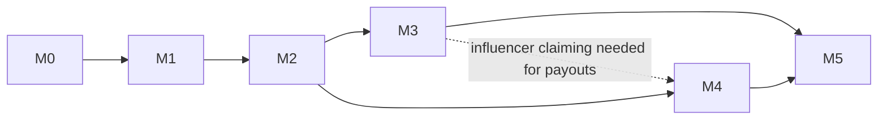

# Reelmap — Roadmap

> How to read this file: phases are strictly ordered (M0 → M5). A phase is **done** when every task tagged with it in `tasks/tasks.json` has `status: "done"` and the exit criteria below pass. Agents: always work the lowest incomplete phase; within it, pick any task whose `depends_on` are all done.
>
> **PRIORITY OVERRIDE (owner request 2026-07-21):** the **[ARCH](#arch--architecture-hardening-highest-priority)** phase (architecture hardening, T-085–T-097) is the **current highest-priority phase** and is worked **before** any remaining M1/M3/M4/M5 backlog. Within ARCH, honor `depends_on`, then P0 before P1.
>
> **PRIORITY OVERRIDE (owner request 2026-09-03):** ARCH is complete; the **[GROW](#grow--retrieval-reach--first-revenue)** phase (T-155–T-167) is now the **current highest-priority phase**, worked before the remaining M1/M3/M4/M5 backlog. Two items are explicitly deferred to the END of the whole queue by owner decision: **product analytics (GA4)** second-to-last, and the **Mercado Pago payout rail** after it. Within GROW, honor `depends_on`.

## Phase overview

| Phase | Name | Goal (one line) | Depends on |
|-------|------|-----------------|------------|
| M0 | Foundations | Monorepo, Laravel 13 API + Expo app scaffolds, auth — a logged-in user on a phone talking to the API | — |
| M1 | Ingest & Analyze | The core loop: share a reel from Instagram → async AI pipeline → confirmed place entry | M0 |
| M2 | Map & Discovery | Places on a clustered map, place pages, tags, search, feed, dedup review | M1 |
| M3 | Social | Public profiles, influencer identities & claiming, follows, notifications center | M2 |
| M4 | Monetization | Restaurant claims & offers, QR redemptions with attribution, double-entry ledger, Stripe Connect payouts | M2 (M3 for influencer claiming) |
| M5 | Hardening & Launch | Moderation, GDPR, observability, E2E tests, store submission, production deploy, GitHub Actions CI (scheduled last) | M1–M4 |
| **ARCH** | **Architecture Hardening** | **Correctness/data-integrity fixes, observability, contract safety, god-object decomposition surfaced by the 2026-07-21 audit — worked next, ahead of remaining backlog** | **M0–M2 (all deps already done)** |
| **GROW** | **Retrieval, Reach & First Revenue** | **The map answers "where do I eat, here, now"; shared links stop being dead ends; Destacado is the first revenue line — from the 2026-09-03 agency growth review** | **M2 (T-155 for hours)** |

## M0 — Foundations

**Outcome:** a developer (or agent) can run the API and the mobile app locally; a user can register, log in, and see an authenticated home screen. Quality gates run locally (and via `/coderabbit` per PR); server-side CI is deferred to M5 (T-006).

Scope: monorepo scaffold; Laravel 13 API (resolve latest stable versions at scaffold time); Postgres + PostGIS; Sanctum auth; Redis + Horizon; Filament admin; Expo app (latest SDK, expo-router, dev client); `packages/contracts` with the extraction JSON schema + generated TS types; S3/R2 storage config. _(GitHub Actions CI (T-006) reprioritized to the end of the queue — see M5.)_

**Exit criteria**
- `apps/api`: `composer test` (Pest) green, `pint --test` and `phpstan` clean; `/api/v1/auth/*` + `/api/v1/me` working.
- `apps/mobile`: `tsc --noEmit`, eslint, jest green; login/register flow works against local API on iOS simulator + Android emulator (dev client build).
- `packages/contracts/extraction.schema.json` validates sample payloads in both PHP (API test) and TS (mobile test).
- Quality gates green locally on every task (server-side CI enforcement moved to M5 / T-006).

## M1 — Ingest & Analyze (the core loop)

**Outcome:** share an Instagram reel URL into the app (share sheet or paste) → pipeline fetches, transcribes, extracts, geocodes → user confirms/corrects → published place entry with attribution. Local model (Ollama) first, OpenRouter fallback with user-selectable model.

Scope: migrations for influencers/source_posts/shares/media_assets/analysis_runs/places/place_sources; `SourceAdapter` interface + Instagram (oEmbed/yt-dlp), X, TikTok/YouTube, Manual adapters; Instagram account linking (OAuth) for private posts; job chain (Fetch → DownloadMedia → PrepareMedia → Transcribe → Extract → ResolvePlace → Publish); ModelRouter (Ollama health-check + OpenRouter fallback + `GET /models`); Geocoder contract (Google Places impl); share status API; mobile share-intent, status, and extraction-review screens; push notification on completion.

**Exit criteria**
- Integration test: fake adapter + fake model → share goes `pending → … → published` and creates a place with a PostGIS point.
- Real-world smoke: a public Instagram reel URL produces a confirmed place entry end-to-end on a device.
- Killing Ollama mid-run causes a recorded OpenRouter fallback run (`analysis_runs` rows for both attempts, with cost).
- Low-confidence extraction routes to `review` status and the mobile review screen can correct + publish it.

## M2 — Map & Discovery

**Outcome:** every published place is discoverable: clustered map driven by viewport, place detail pages with source videos + attribution, tag/cuisine/price filters, text search, a basic feed. Duplicate places get merged.

Scope: `GET /map/places` bbox query with clustering; places index/show; tags + Scout/Meilisearch; mobile Map, Place detail, Search, Feed screens; Filament dedup/merge review queue. Design track (T-060/T-061): a design-agent-produced visual spec (`design/DESIGN-AGENT-PROMPT.md` → committed HTML prototype + design tokens), then the web demo rebuilt to it; the tokens later seed the mobile theme.

**Exit criteria**
- Map at city zoom returns clusters in <300ms p95 with 10k seeded places.
- Two shares of the same restaurant (different posts) attach to one place; a wrong merge can be undone in Filament.
- Place detail shows: extracted data, every source post (link-out to original), influencer, sharer.

## M3 — Social

**Outcome:** Instagram-like accounts: public user profiles, canonical influencer profiles with claim flow, follows, "following" map/feed filters, notifications center.

Scope: profile APIs + screens; influencer claiming (platform OAuth or bio-code verification); follows; notification center; settings incl. AI model preference and GDPR self-service stubs.

**Exit criteria**
- An influencer can claim their auto-created identity and their public profile shows their map + shares.
- Following an influencer filters map/feed; follow triggers a push notification.

### Personalization add-ons (requested 2026-07-13)

User-curation features layered onto the discovery surfaces. Not blockers for the M3 exit
criteria above — sequence them after the core social work as capacity allows.

- **T-062 Lists** — save a place into named personal collections and view them together on
  a map (e.g. gather a country's places, then see them all when you travel there).
- **T-063 Share lists** — make a list public + shareable (deep link), read-only view for
  recipients, "save a copy" for authed viewers. Depends on T-062.
- **T-064 Private per-user tags** — personal labels on a place visible only to the owner
  (e.g. "visitar a las 5"); never exposed to others or the global/AI tags.
- **T-065 Place-detail enrichments** (M2 surface) — opening-hours display (+ port to web
  demo) and a "View on Google Maps" link when `google_place_id` exists. The
  "last-updated menu prices" line is already shipped (PRs #53/#54); this task just keeps it.
- **T-070 Identifiable map markers** (M2 surface, requested 2026-07-14) — Google-style photo
  bubbles (primary reel poster via `thumbnail_url`) + place name on the pin, collapsing to a
  dot when zoomed out; price-teardrop fallback when a place has no imagery. Web demo at parity.

## M4 — Monetization

**Outcome:** the incentive loop works: restaurant claims its place → publishes an offer → diner redeems via QR at the restaurant → attributed to influencer + sharer → ledger entries → influencer sees earnings → Stripe Connect payout.

Scope: place_claims + verification; offers CRUD (API, restaurant screens, Filament); redemption issue/verify with anti-fraud (uniqueness, geofence, velocity); double-entry ledger service; Stripe Connect Express onboarding, transfers, webhooks; wallet API + screen; influencer dashboard metrics.

**Exit criteria**
- Full loop test: seeded offer → redemption issued → verified by restaurant account → ledger balanced (sum debits = sum credits) → influencer balance increased → payout request creates Stripe transfer (test mode).
- Fraud checks covered by tests: duplicate redemption, expired code, wrong-restaurant verify all rejected.

## M5 — Hardening & Launch

**Outcome:** production-ready: moderation + takedown, GDPR compliance, quotas/cost controls, observability, E2E suite, store submissions, deployed infrastructure.

Scope: reports + moderation queue + DMCA flow; GDPR export/delete jobs + media retention enforcement (originals deleted post-analysis); per-user analysis quotas + cost dashboard; Sentry + Horizon alerting; Maestro E2E (share→publish); map load test; privacy policy + store checklists + EAS submit; Forge provisioning + Ollama host + runbooks; **GitHub Actions CI (T-006) — the final task in the queue**, gated behind T-054/T-055.

**Exit criteria**
- Maestro E2E green in CI against staging; account deletion fully purges user data (verified by test).
- Apps submitted to TestFlight + Play internal track; staging + production environments documented in runbooks.
- GitHub Actions CI (T-006) green on `main`: api (Pint/PHPStan/Pest on PostGIS+Redis), mobile (eslint/tsc/jest), contracts (schema + drift). _Scheduled last per request; note the tension with "Maestro E2E green in CI" above, which assumes CI exists earlier — flagged for revisit._

## ARCH — Architecture Hardening (highest priority)

**Origin:** a seasoned-architect audit of the backend + frontend on **2026-07-21** (four parallel
agents: API/service layer, domain/data/money, mobile, cross-cutting). 50 raw findings →
13 prioritized tasks (**T-085–T-097**). This phase is worked **before** the remaining M1/M3/M4/M5
backlog per owner request. All dependencies are already `done`, so every task is immediately
workable. Each ships with meaningful tests + gates like any other task; deviations recorded as ADRs.

**P0 — correctness & data integrity (do first)**
- **T-085** `PlaceEditor.apply()` lock+refetch before diffing `locked_fields` — closes the
  enrichment-clobbers-manual-edit race (confirmed against source; breaks the T-084 "override wins"
  guarantee).
- **T-086** Eliminate the `GET /shares` N+1 (`Place::coordinates()` per-place raw query) — confirmed.
- **T-087** Lock `PlacePublisher::recompute()`'s count-then-save — concurrent-publish counter race.
- **T-088** "My places" filter facets over the full collection, not page 1 (silent 20-row cap).
- **T-089** `unmerge()` restores `place_list_items`/`hidden_places` — admin-undo data loss.

**P1 — reliability, observability, contract safety**
- **T-090** Mobile top-level `ErrorBoundary` + crash reporting (none today ⇒ blank-screen crashes).
- **T-091** Sentry (or equiv) on the API HTTP handler + queue failed-job hook. *(pulls the core of
  M5 T-052 forward)*
- **T-092** Real `request_id` — `AssignRequestId` middleware + log/job propagation (nothing sets it today).
- **T-093** Finish `ShareStageMetric`: completion/failure/duration, not just a `running` marker.
- **T-094** Mobile consumes `@reelmap/contracts` instead of hand-duplicated API types (the one
  un-diffed drift gap). *(relates to CI T-006)*

**P1 — god-object decomposition**
- **T-095** Split `PlaceResolver` (783 lines) → `PlaceDedupMatcher` + `PlaceFactory`; drop the
  duplicate hand-rolled Jaro-Winkler.
- **T-096** Decompose the `Place` god model (787 lines) → `PlaceAggregations`; add a
  discount SQL↔PHP twin-drift test.
- **T-097** Extract `ShareController::update()`'s ~150-line merge/diff engine → `ExtractionCorrector`.

**Deferred from the audit (not in this phase):** consistency/cleanup items (Policies vs inline
ownership checks, `PlatformAccountController` error-envelope dup, shared mobile Card/Row primitives,
status-aware React Query retry, coverage gate + CI-gated Maestro, `ExtractionSchema`→injectable,
`useSharePolling` dedup, `Place.$fillable` tightening, PHPStan 6→8/9, `source_posts.platform`
unknown-value ADR). The **ledger/offers/redemptions** (M4) and **GDPR erasure** (M5 T-050) systems
don't exist yet — the audit's guidance is to build them *with* `PlaceMerger`-grade locking/idempotency
when they land.

**Exit criteria**
- All T-085–T-097 `done`; each with meaningful tests (happy + failure/edge) and green gates.
- The two confirmed correctness defects (T-085 lock-race, T-086 N+1) have regression tests that
  fail before the fix and pass after.
- No behavioral regressions: contract drift green; API/mobile suites green.

## GROW — Retrieval, Reach & First Revenue

**Origin:** an agency growth review on **2026-09-03** (six independent specialists: market,
growth loops, creator virality, product/business model, engagement, platform leverage) plus the
owner's own product model, both recorded in `08-growth-and-opportunities.md`. 13 tasks
(**T-155–T-167**), worked before the remaining M1/M3/M4/M5 backlog.

**The product model this phase serves** (08 §9): the map is a list of places you **want to
visit**, filled from reels *and* from a friend's recommendation. The query it must answer is
*this zone → what I feel like eating → is it open right now → pick one*.

**Retrieval — the core query (do first)**
- **T-155** structured hours + timezone → a real `open_now`. *(Owner decision 2026-09-03: proceed —
  "it's 11pm, is it already closed?" is the product's own question.)*
- **T-156** distance + open/closed on the map pin payload and the pin sheet; `sort=distance`; the
  map centers on the viewer instead of their last viewport.
- **T-157** dishes promoted out of `extraction_snapshot_json` into a queryable table — "who does
  pasta" is unanswerable today.
- **T-158** **Tonight**, the decision surface that composes all three.

**Filling the empty map**
- **T-159** curated maps as **live subscriptions** shown as a **toggleable layer** (owner
  decisions D1, D2).
- **T-160** registering stops making the map emptier; real empty state; three starter saves.
- **T-161** the review screen asks one question instead of forty-two.
- **T-162** been-there — the completion of a want-to-go pin, and Tonight's ranking signal.

**Reach**
- **T-163** Universal Links + App Links + server-rendered OG — every shared link is a dead end
  until this ships, which makes it the multiplier on everything below.
- **T-164** invite links that can be attributed + creator suggestions from your own shares.
- **T-165** opt-in contacts matching, with only salted hashes leaving the device (owner decision D3;
  Instagram exposes no friend graph to third parties).
- **T-167** the public web surface — `/@handle` creator maps and place pages. **Reverses
  00-product-spec §6.1** ("web app out of scope"); record as an ADR when it lands.

**First revenue**
- **T-166** **Destacado** — flat monthly labeled placement, sold by hand, no payment rail needed
  (owner decision D4). Its blocking acceptance criterion is the guard test: promoted placement
  must never reorder the "open now, near me" answer.

**Exit criteria**
- A user standing in a neighborhood at 23:00 can go from opening the app to a shortlist of places
  that are near them, serve what they want, and are open — in one surface, without tapping through
  to a detail page to learn either fact.
- A list URL pasted into WhatsApp renders a real preview card, and opens the app when installed and
  the web page when not — asserted by a test and a Maestro flow, not by a screenshot.
- A new user's first session ends with a non-empty map.
- One venue is paying for a Destacado, and a test proves that promotion cannot reorder the near-me
  answer.

## Dependency graph (phase level)

